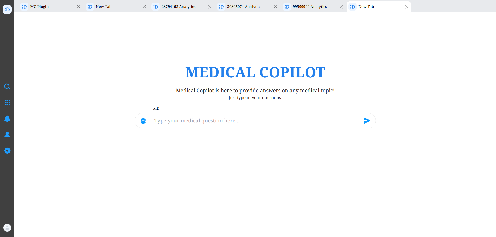
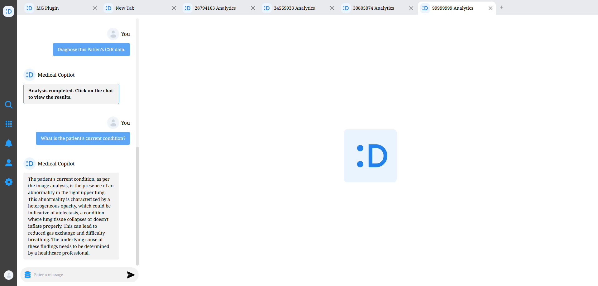
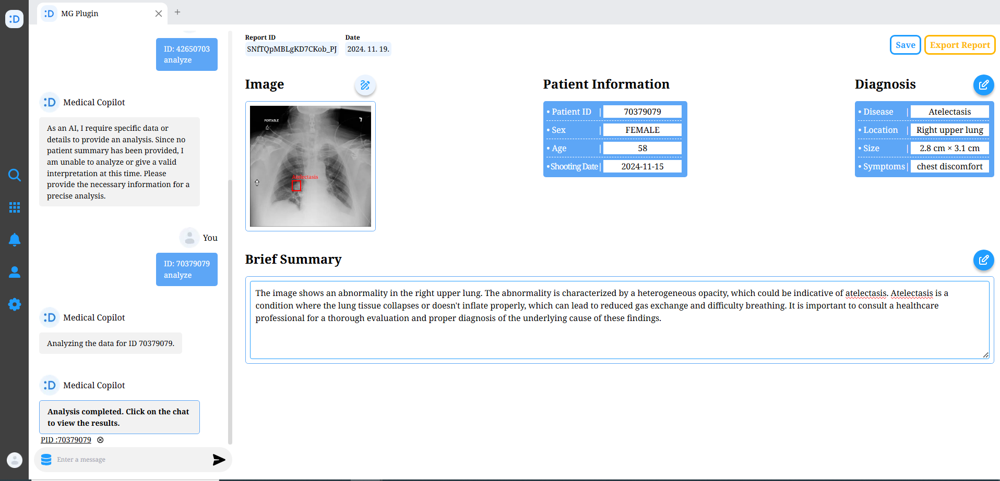
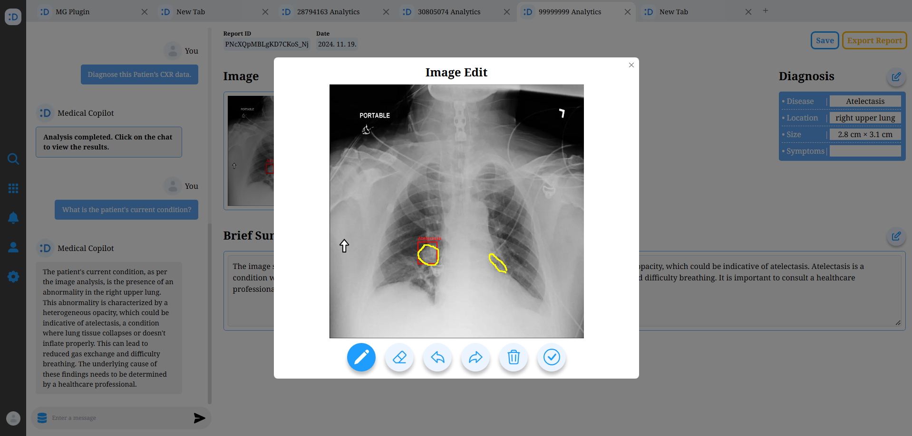
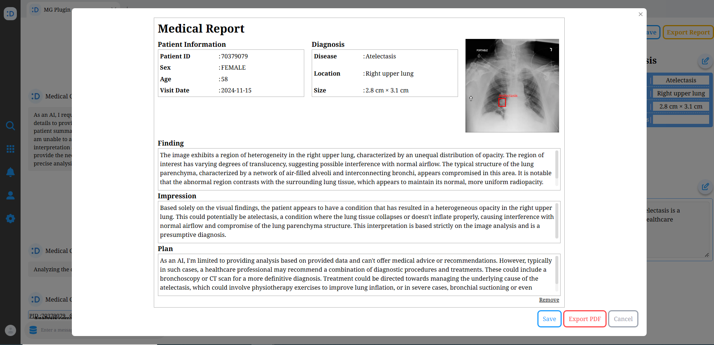
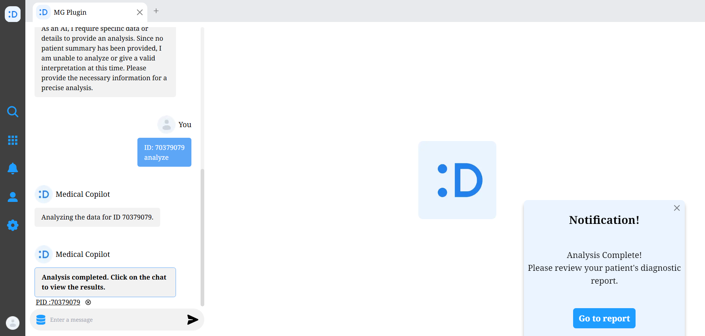
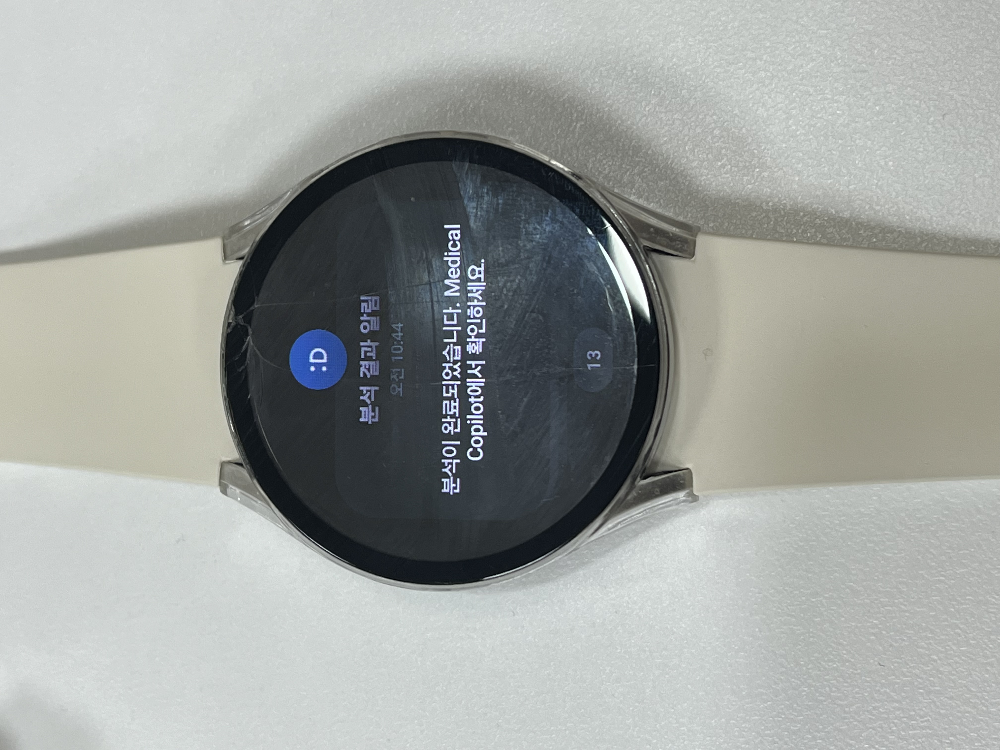
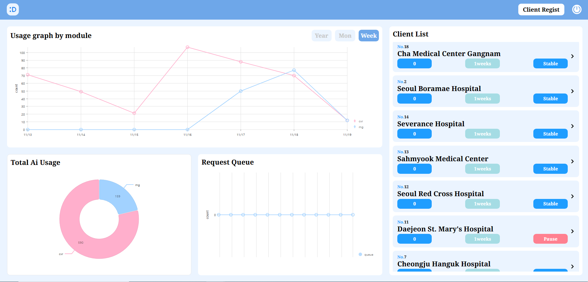
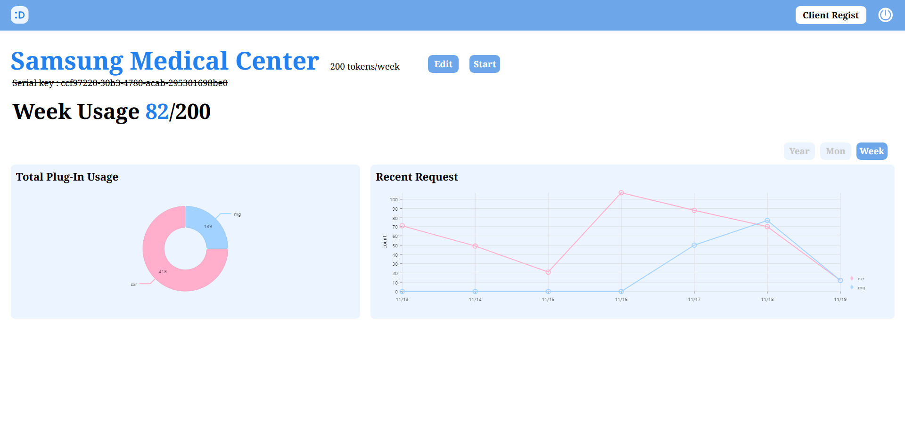

<div align="center">

</div>

<div align="center">
<h1>Medical-Copilot 🏥 의료진을 위한 AI 병증진단분석 서비스</h1> 
</div>

**SSAFY 11기 2학기 자율 프로젝트 (기업연계)**
>**개발기간: 24.10.14~24.11.19(6주)**

<details>
<summary>시연 영상 링크</summary>
<div markdown="0"  align="center">

[](https://youtu.be/09fVQTDObuY) 

</div>
</details>


## 화면구성 📺
<!-- <details> -->
<!-- <summary>gif</summary> -->
<!-- <div markdown="5"> -->
  
<!-- ||
| :---: |
|**메인화면**|
|  |
| **채팅화면** |
|  |
| **보고서 조회** |
|  |
| **보고서 편집** |
|  |
| **내보내기 보고서 생성** |
|  |
| **웹 알림 화면** |
|  |
| **워치 알림 화면** |
|  |
| **(관리자)메인화면** |
|  |
| **(관리자)고객사 상세 페이지** |
|  | -->


<!-- </div> -->
<!-- </details> -->
### Medical Copilot (온프레미스)
<table style="width: 100%; text-align: center;">
  <tr>
    <th>기능이름</th>
    <th>메인화면</th>
    <th>채팅화면</th>
  </tr>
  <tr>
    <td><strong>이미지</strong></td>
    <td></td>
    <td></td>
  </tr>
  <tr>
    <th>기능이름</th>
    <th>보고서 조회</th>
    <th>보고서 편집</th>
  </tr>
  <tr>
    <td><strong>이미지</strong></td>
    <td></td>
    <td></td>
  </tr>
  <tr>
    <th>기능이름</th>
    <th>내보내기 보고서 생성</th>
    <th>웹 알림 화면</th>
  </tr>
  <tr>
    <td><strong>이미지</strong></td>
    <td></td>
    <td></td>
  </tr>
  <tr>
    <th>기능이름</th>
    <th>워치 알림 화면</th>
    <th></th>
  </tr>
  <tr>
    <td><strong>이미지</strong></td>
    <td></td>
    <td></td>
  </tr>
  
</table>

### 관리자 (클라우드)
<table style="width: 100%; text-align: center;">
  <tr>
    <th>기능이름</th>
    <th>메인화면</th>
    <th>고객사 상세 페이지</th>
  </tr>
  <tr>
    <td><strong>이미지</strong></td>
    <td></td>
    <td></td>
  </tr>
</table>

## 핵심 기능 소개 🔑
- **AI 진단 및 병증 탐지**: 흉부 X-Ray 이미지에서 병증을 탐지하고 발견된 질병을 보고서로 제공하여 시간 절약 ⏱️
- **의료 특화 챗봇 기반 질의응답**: 의료 데이터로 특화된 LLM 모델을 기반으로 실시간으로 질문에 대한 답변을 제공해주는 인터랙티브 챗봇 🤖
- **문맥 기반 보고서 생성 및 PDF 다운로드**: langChain을 통해 문맥이 유지되는 보고서(finding, impression, plan) 생성 및 생성된 진단 보고서 PDF를 다운로드 🔍
- **보고서 생성 알림**: SSE를 통해 보고서 생성 완료 알림(웹, 태블릿, 워치) 제공 🔔
- **서비스 이용자 관리**: 클라우드 서비스에서 Medical Copilot 서비스를 이용하는 고객들을 통합 관리 📊

1. **AI 진단 및 병증 탐지** ✨
   - 흉부 X-Ray 이미지에서 의료데이터로 가중치 학습된 ResNet-50, YOLO v8 모델로 병증 위치 탐지 및 의료 데이터로 파인튜닝된 VLM 모델(LLaVA-Med)을 통해 병증을 진단하여 보고서로 제공합니다!

2. **의료 특화 챗봇 기반 질의응답** 🤖
   - 의료 데이터 특화 LLM 모델인 LLaMA-3.8을 사용하여 의료 전문 대화를 지원합니다.

3. **문맥 기반 보고서 생성 및 PDF 다운로드** 📄
   - langChain을 통해 문맥이 유지되는 보고서(finding, impression, plan)를 순차적으로 생성하고, 생성된 보고서는 PDF 다운로드를 제공합니다.

4. **보고서 생성 알림** 🔔
   - SSE(Server-Sent-Event)를 통해 웹, 태블릿, 워치 등 로그인 된 모든 기기에서 보고서 생성 완료 알림을 받을 수 있습니다!

5. **서비스 이용자 관리** 📊
   - Medical Copilot 서비스는 Onpremise 방식으로 제공됩니다. 서비스를 이용하는 병원 고객 각각의 AI 서비스 이용량 및 통계 정보를 클라우드 서비스로 제공합니다.

   
## 주요기술 📦
### ⭐️ LangChain
- 리포트 내보내기, 범용의학질문 시 적용
- Chain을 이용하여 자동화된 파이프라인을 구성함으로써 문맥을 유지한 질문 및 답변 기능 제공

### ⭐️ 프롬프트 엔지니어링
- 다양한 오픈소스 모델을 테스트하여 최적의 모델 선정(Llama3.8 medical tune)
- 질문에 따라 5가지 분기처리를 통해 최적화된 프롬프트를 생성하여 맞춤형 템플릿 적용
  
### ⭐️할루시네이션 방지
- 신뢰도 기반 분석
  - classification & Detection 모델에서 병증 1차 판별
  - 신뢰도와 결과를 기반으로 VLM응답 생성
  - 참조 및 비교대상의 존재로 할루시네이션 현상 감소
- Feedback Loop
  - LLM의 응답을 input과 비교검증하며 타당도 검증


## 개발팀 소개

| 전성모 (FRONT) | 권성민 (FRONT) | 이윤주 (FRONT) |
| --- | --- | --- | 
| ||
| [@jeonsm22](https://github.com/jeonsm22) |  [@kwonja](https://github.com/kwonja) | [@yujachaa](https://github.com/yujachaa) |

| 윤여준 (BACK) | 이서영 (BACK) | 허지영 (BACK) |
| --- | --- | --- |
| ||
| [@joon-kr](https://github.com/joon-kr) |  [@SL01223](https://github.com/SL01223) | [@jiyoung-Heo](https://github.com/jiyoung-Heo) |

## 기술 스택, 빌드 버전 및 기타 도구

### Onpremise Server


### Cloud Server


### AI Architecture


### Frontend
 


### Backend
 


 


### Data


### AI


### Infra


### 기타 도구

 
 


### 버전
<details>
<summary>version</summary>
<div markdown="1">

```text
- React: 18.3.1
- Next.js: 14.2.16
- Redux : 5.0.1
- Node.js: 20.18.0
- Java: 17
- Spring boot: 3.3.5
- gradle : 8.10
- PostgreSQL: 8
- Redis: 7.4
- Elasticsearch: 8.13.4
- Kibana: 8.13.4
- Logstash: 8.13.4
- python: 3.13
- AWS EC2 Ubuntu: 20.04.6 LTS
- Docker: 27.3.1
- Docker-compose: 1.29.7
- Jenkins: 2.452.3
- certbot: 2.11.0
- Nginx: 1.27.2
- Visual Studio Code: 1.90.2
- IntelliJ IDEA: 2024.1.4

```
</div>
</details>

## 디렉토리 구조
<details>
<summary>FrontEnd-Onpremise</summary>
<div markdown="1">

```text
📦FrontEnd
 ┣ 📂.husky
 ┃ ┣ 📜pre-commit
 ┃ ┗ 📜pre-push
 ┣ 📂.storybook
 ┃ ┣ 📜main.ts
 ┃ ┗ 📜preview.ts
 ┣ 📂public
 ┃ ┣ 📜CAPSULE.png
 ┃ ┣ 📜CT.png
 ┃ ┣ 📜CXR.png
 ┃ ┣ 📜file.svg
 ┃ ┣ 📜globe.svg
 ┃ ┣ 📜icon512_maskable.png
 ┃ ┣ 📜icon512_rounded.png
 ┃ ┣ 📜Logo_Landing.png
 ┃ ┣ 📜manifest.json
 ┃ ┣ 📜MG.png
 ┃ ┣ 📜next.svg
 ┃ ┣ 📜vercel.svg
 ┃ ┗ 📜window.svg
 ┣ 📂src
 ┃ ┣ 📂apis
 ┃ ┃ ┣ 📜alarm.ts
 ┃ ┃ ┣ 📜core.ts
 ┃ ┃ ┣ 📜fetchLogin.ts
 ┃ ┃ ┣ 📜fetchLogout.ts
 ┃ ┃ ┣ 📜fetchPDF.ts
 ┃ ┃ ┣ 📜fetchRegist.ts
 ┃ ┃ ┣ 📜find.ts
 ┃ ┃ ┣ 📜fip.ts
 ┃ ┃ ┣ 📜impression.ts
 ┃ ┃ ┣ 📜message.ts
 ┃ ┃ ┣ 📜Patient.ts
 ┃ ┃ ┣ 📜plan.ts
 ┃ ┃ ┣ 📜report.ts
 ┃ ┃ ┗ 📜user.ts
 ┃ ┣ 📂app
 ┃ ┃ ┣ 📂api
 ┃ ┃ ┃ ┗ 📂generate-pdf
 ┃ ┃ ┃ ┃ ┗ 📜route.ts
 ┃ ┃ ┣ 📂components
 ┃ ┃ ┃ ┗ 📜index.ts
 ┃ ┃ ┣ 📂login
 ┃ ┃ ┃ ┣ 📂components
 ┃ ┃ ┃ ┃ ┣ 📂LoginInput
 ┃ ┃ ┃ ┃ ┃ ┣ 📜LoginInput.module.scss
 ┃ ┃ ┃ ┃ ┃ ┗ 📜LoginInput.tsx
 ┃ ┃ ┃ ┃ ┗ 📂LoginTitle
 ┃ ┃ ┃ ┃ ┃ ┣ 📜LoginTitle.module.scss
 ┃ ┃ ┃ ┃ ┃ ┗ 📜LoginTitle.tsx
 ┃ ┃ ┃ ┣ 📜page.module.scss
 ┃ ┃ ┃ ┗ 📜page.tsx
 ┃ ┃ ┣ 📂medical
 ┃ ┃ ┃ ┣ 📂chat
 ┃ ┃ ┃ ┃ ┗ 📂[id]
 ┃ ┃ ┃ ┃ ┃ ┣ 📂components
 ┃ ┃ ┃ ┃ ┃ ┃ ┣ 📂chat
 ┃ ┃ ┃ ┃ ┃ ┃ ┃ ┣ 📂PatientDB
 ┃ ┃ ┃ ┃ ┃ ┃ ┃ ┃ ┣ 📜CheckModality.ts
 ┃ ┃ ┃ ┃ ┃ ┃ ┃ ┃ ┣ 📜FilteredPatientDB.tsx
 ┃ ┃ ┃ ┃ ┃ ┃ ┃ ┃ ┣ 📜Modality.module.scss
 ┃ ┃ ┃ ┃ ┃ ┃ ┃ ┃ ┣ 📜Modality.tsx
 ┃ ┃ ┃ ┃ ┃ ┃ ┃ ┃ ┣ 📜PatientDB.module.scss
 ┃ ┃ ┃ ┃ ┃ ┃ ┃ ┃ ┗ 📜PatientDB.stories.tsx
 ┃ ┃ ┃ ┃ ┃ ┃ ┃ ┣ 📜ChatInput.module.scss
 ┃ ┃ ┃ ┃ ┃ ┃ ┃ ┣ 📜ChatInput.tsx
 ┃ ┃ ┃ ┃ ┃ ┃ ┃ ┣ 📜Message.module.scss
 ┃ ┃ ┃ ┃ ┃ ┃ ┃ ┣ 📜Message.tsx
 ┃ ┃ ┃ ┃ ┃ ┃ ┃ ┣ 📜MessageList.module.scss
 ┃ ┃ ┃ ┃ ┃ ┃ ┃ ┗ 📜MessageList.tsx
 ┃ ┃ ┃ ┃ ┃ ┃ ┗ 📂report
 ┃ ┃ ┃ ┃ ┃ ┃ ┃ ┣ 📜CanvasOverlay.tsx
 ┃ ┃ ┃ ┃ ┃ ┃ ┃ ┣ 📜Diagnosis.tsx
 ┃ ┃ ┃ ┃ ┃ ┃ ┃ ┣ 📜EditModal.module.scss
 ┃ ┃ ┃ ┃ ┃ ┃ ┃ ┣ 📜EditModal.tsx
 ┃ ┃ ┃ ┃ ┃ ┃ ┃ ┣ 📜ExportModal.module.scss
 ┃ ┃ ┃ ┃ ┃ ┃ ┃ ┣ 📜ExportModal.tsx
 ┃ ┃ ┃ ┃ ┃ ┃ ┃ ┣ 📜ImageSection.tsx
 ┃ ┃ ┃ ┃ ┃ ┃ ┃ ┣ 📜PatientInfo.tsx
 ┃ ┃ ┃ ┃ ┃ ┃ ┃ ┣ 📜PluginInfo.module.scss
 ┃ ┃ ┃ ┃ ┃ ┃ ┃ ┣ 📜PluginInfo.tsx
 ┃ ┃ ┃ ┃ ┃ ┃ ┃ ┣ 📜RectangleOverlay.tsx
 ┃ ┃ ┃ ┃ ┃ ┃ ┃ ┣ 📜ReportBtn.tsx
 ┃ ┃ ┃ ┃ ┃ ┃ ┃ ┣ 📜ReportData.module.scss
 ┃ ┃ ┃ ┃ ┃ ┃ ┃ ┣ 📜ReportData.tsx
 ┃ ┃ ┃ ┃ ┃ ┃ ┃ ┣ 📜ReportInfo.tsx
 ┃ ┃ ┃ ┃ ┃ ┃ ┃ ┗ 📜Summary.tsx
 ┃ ┃ ┃ ┃ ┃ ┣ 📜ChatLayout.tsx
 ┃ ┃ ┃ ┃ ┃ ┣ 📜page.module.scss
 ┃ ┃ ┃ ┃ ┃ ┗ 📜page.tsx
 ┃ ┃ ┃ ┣ 📂main
 ┃ ┃ ┃ ┃ ┣ 📂components
 ┃ ┃ ┃ ┃ ┃ ┣ 📜Input.module.scss
 ┃ ┃ ┃ ┃ ┃ ┣ 📜Input.tsx
 ┃ ┃ ┃ ┃ ┃ ┣ 📜Main.module.scss
 ┃ ┃ ┃ ┃ ┃ ┣ 📜Main.stories.tsx
 ┃ ┃ ┃ ┃ ┃ ┗ 📜MainLayout.tsx
 ┃ ┃ ┃ ┃ ┗ 📜page.tsx
 ┃ ┃ ┃ ┣ 📂mychat
 ┃ ┃ ┃ ┃ ┣ 📂components
 ┃ ┃ ┃ ┃ ┃ ┣ 📂chat
 ┃ ┃ ┃ ┃ ┃ ┃ ┣ 📜ChatInput.module.scss
 ┃ ┃ ┃ ┃ ┃ ┃ ┣ 📜ChatInput.tsx
 ┃ ┃ ┃ ┃ ┃ ┃ ┣ 📜Message.module.scss
 ┃ ┃ ┃ ┃ ┃ ┃ ┣ 📜Message.tsx
 ┃ ┃ ┃ ┃ ┃ ┃ ┣ 📜MessageList.module.scss
 ┃ ┃ ┃ ┃ ┃ ┃ ┗ 📜MessageList.tsx
 ┃ ┃ ┃ ┃ ┃ ┗ 📂report
 ┃ ┃ ┃ ┃ ┃ ┃ ┣ 📜CanvasOverlay.tsx
 ┃ ┃ ┃ ┃ ┃ ┃ ┣ 📜Diagnosis.tsx
 ┃ ┃ ┃ ┃ ┃ ┃ ┣ 📜EditModal.module.scss
 ┃ ┃ ┃ ┃ ┃ ┃ ┣ 📜EditModal.tsx
 ┃ ┃ ┃ ┃ ┃ ┃ ┣ 📜ExportModal.module.scss
 ┃ ┃ ┃ ┃ ┃ ┃ ┣ 📜ExportModal.tsx
 ┃ ┃ ┃ ┃ ┃ ┃ ┣ 📜ImageSection.tsx
 ┃ ┃ ┃ ┃ ┃ ┃ ┣ 📜PatientInfo.tsx
 ┃ ┃ ┃ ┃ ┃ ┃ ┣ 📜PluginInfo.module.scss
 ┃ ┃ ┃ ┃ ┃ ┃ ┣ 📜PluginInfo.tsx
 ┃ ┃ ┃ ┃ ┃ ┃ ┣ 📜RectangleOverlay.tsx
 ┃ ┃ ┃ ┃ ┃ ┃ ┣ 📜ReportBtn.tsx
 ┃ ┃ ┃ ┃ ┃ ┃ ┣ 📜ReportData.module.scss
 ┃ ┃ ┃ ┃ ┃ ┃ ┣ 📜ReportData.tsx
 ┃ ┃ ┃ ┃ ┃ ┃ ┣ 📜ReportInfo.tsx
 ┃ ┃ ┃ ┃ ┃ ┃ ┗ 📜Summary.tsx
 ┃ ┃ ┃ ┃ ┣ 📜MyChat.tsx
 ┃ ┃ ┃ ┃ ┣ 📜page.module.scss
 ┃ ┃ ┃ ┃ ┗ 📜page.tsx
 ┃ ┃ ┃ ┣ 📂mypage
 ┃ ┃ ┃ ┃ ┣ 📂components
 ┃ ┃ ┃ ┃ ┃ ┣ 📂MyPageInfo
 ┃ ┃ ┃ ┃ ┃ ┃ ┗ 📜MyPageInfo.tsx
 ┃ ┃ ┃ ┃ ┃ ┣ 📂MyPageTab
 ┃ ┃ ┃ ┃ ┃ ┃ ┣ 📜MyPageTab.module.scss
 ┃ ┃ ┃ ┃ ┃ ┃ ┗ 📜MyPageTab.tsx
 ┃ ┃ ┃ ┃ ┃ ┣ 📂MyPageTitle
 ┃ ┃ ┃ ┃ ┃ ┃ ┣ 📜MyPageTitle.module.scss
 ┃ ┃ ┃ ┃ ┃ ┃ ┗ 📜MyPageTitle.tsx
 ┃ ┃ ┃ ┃ ┃ ┣ 📂NameInput
 ┃ ┃ ┃ ┃ ┃ ┃ ┣ 📜NameInput.module.scss
 ┃ ┃ ┃ ┃ ┃ ┃ ┗ 📜NameInput.tsx
 ┃ ┃ ┃ ┃ ┃ ┣ 📂Plan
 ┃ ┃ ┃ ┃ ┃ ┃ ┣ 📜Plan.module.scss
 ┃ ┃ ┃ ┃ ┃ ┃ ┗ 📜Plan.tsx
 ┃ ┃ ┃ ┃ ┃ ┣ 📂PWInput
 ┃ ┃ ┃ ┃ ┃ ┃ ┣ 📜PWInput.module.scss
 ┃ ┃ ┃ ┃ ┃ ┃ ┗ 📜PWInput.tsx
 ┃ ┃ ┃ ┃ ┃ ┣ 📂RemainBar
 ┃ ┃ ┃ ┃ ┃ ┃ ┣ 📜RemainBar.module.scss
 ┃ ┃ ┃ ┃ ┃ ┃ ┗ 📜RemainBar.tsx
 ┃ ┃ ┃ ┃ ┃ ┗ 📂UserProfile
 ┃ ┃ ┃ ┃ ┃ ┃ ┣ 📜UserProfile.module.scss
 ┃ ┃ ┃ ┃ ┃ ┃ ┗ 📜UserProfile.tsx
 ┃ ┃ ┃ ┃ ┣ 📜page.module.scss
 ┃ ┃ ┃ ┃ ┗ 📜page.tsx
 ┃ ┃ ┃ ┣ 📂temp
 ┃ ┃ ┃ ┃ ┗ 📂[id]
 ┃ ┃ ┃ ┃ ┃ ┣ 📂components
 ┃ ┃ ┃ ┃ ┃ ┃ ┣ 📂chat
 ┃ ┃ ┃ ┃ ┃ ┃ ┃ ┣ 📜ChatInput.module.scss
 ┃ ┃ ┃ ┃ ┃ ┃ ┃ ┣ 📜ChatInput.tsx
 ┃ ┃ ┃ ┃ ┃ ┃ ┃ ┣ 📜Message.module.scss
 ┃ ┃ ┃ ┃ ┃ ┃ ┃ ┣ 📜Message.tsx
 ┃ ┃ ┃ ┃ ┃ ┃ ┃ ┣ 📜MessageList.module.scss
 ┃ ┃ ┃ ┃ ┃ ┃ ┃ ┗ 📜MessageList.tsx
 ┃ ┃ ┃ ┃ ┃ ┃ ┗ 📂report
 ┃ ┃ ┃ ┃ ┃ ┃ ┃ ┣ 📜CanvasOverlay.tsx
 ┃ ┃ ┃ ┃ ┃ ┃ ┃ ┣ 📜Diagnosis.tsx
 ┃ ┃ ┃ ┃ ┃ ┃ ┃ ┣ 📜EditModal.module.scss
 ┃ ┃ ┃ ┃ ┃ ┃ ┃ ┣ 📜EditModal.tsx
 ┃ ┃ ┃ ┃ ┃ ┃ ┃ ┣ 📜ExportModal.module.scss
 ┃ ┃ ┃ ┃ ┃ ┃ ┃ ┣ 📜ExportModal.tsx
 ┃ ┃ ┃ ┃ ┃ ┃ ┃ ┣ 📜ImageSection.tsx
 ┃ ┃ ┃ ┃ ┃ ┃ ┃ ┣ 📜PatientInfo.tsx
 ┃ ┃ ┃ ┃ ┃ ┃ ┃ ┣ 📜PluginInfo.module.scss
 ┃ ┃ ┃ ┃ ┃ ┃ ┃ ┣ 📜PluginInfo.tsx
 ┃ ┃ ┃ ┃ ┃ ┃ ┃ ┣ 📜RectangleOverlay.tsx
 ┃ ┃ ┃ ┃ ┃ ┃ ┃ ┣ 📜ReportBtn.tsx
 ┃ ┃ ┃ ┃ ┃ ┃ ┃ ┣ 📜ReportData.module.scss
 ┃ ┃ ┃ ┃ ┃ ┃ ┃ ┣ 📜ReportData.tsx
 ┃ ┃ ┃ ┃ ┃ ┃ ┃ ┣ 📜ReportInfo.tsx
 ┃ ┃ ┃ ┃ ┃ ┃ ┃ ┗ 📜Summary.tsx
 ┃ ┃ ┃ ┃ ┃ ┣ 📜page.module.scss
 ┃ ┃ ┃ ┃ ┃ ┣ 📜page.tsx
 ┃ ┃ ┃ ┃ ┃ ┗ 📜TempLayout.tsx
 ┃ ┃ ┃ ┣ 📜layout.tsx
 ┃ ┃ ┃ ┗ 📜page.tsx
 ┃ ┃ ┣ 📂mypage
 ┃ ┃ ┃ ┣ 📂components
 ┃ ┃ ┃ ┃ ┣ 📂MyPageInfo
 ┃ ┃ ┃ ┃ ┃ ┗ 📜MyPageInfo.tsx
 ┃ ┃ ┃ ┃ ┣ 📂MyPageTab
 ┃ ┃ ┃ ┃ ┃ ┣ 📜MyPageTab.module.scss
 ┃ ┃ ┃ ┃ ┃ ┗ 📜MyPageTab.tsx
 ┃ ┃ ┃ ┃ ┣ 📂MyPageTitle
 ┃ ┃ ┃ ┃ ┃ ┣ 📜MyPageTitle.module.scss
 ┃ ┃ ┃ ┃ ┃ ┗ 📜MyPageTitle.tsx
 ┃ ┃ ┃ ┃ ┣ 📂NameInput
 ┃ ┃ ┃ ┃ ┃ ┣ 📜NameInput.module.scss
 ┃ ┃ ┃ ┃ ┃ ┗ 📜NameInput.tsx
 ┃ ┃ ┃ ┃ ┣ 📂Plan
 ┃ ┃ ┃ ┃ ┃ ┣ 📜Plan.module.scss
 ┃ ┃ ┃ ┃ ┃ ┗ 📜Plan.tsx
 ┃ ┃ ┃ ┃ ┣ 📂PWInput
 ┃ ┃ ┃ ┃ ┃ ┣ 📜PWInput.module.scss
 ┃ ┃ ┃ ┃ ┃ ┗ 📜PWInput.tsx
 ┃ ┃ ┃ ┃ ┣ 📂RemainBar
 ┃ ┃ ┃ ┃ ┃ ┣ 📜RemainBar.module.scss
 ┃ ┃ ┃ ┃ ┃ ┗ 📜RemainBar.tsx
 ┃ ┃ ┃ ┃ ┗ 📂UserProfile
 ┃ ┃ ┃ ┃ ┃ ┣ 📜UserProfile.module.scss
 ┃ ┃ ┃ ┃ ┃ ┗ 📜UserProfile.tsx
 ┃ ┃ ┃ ┣ 📜layout.tsx
 ┃ ┃ ┃ ┣ 📜page.module.scss
 ┃ ┃ ┃ ┗ 📜page.tsx
 ┃ ┃ ┣ 📂pdf
 ┃ ┃ ┃ ┣ 📂[reportId]
 ┃ ┃ ┃ ┃ ┣ 📜page.module.scss
 ┃ ┃ ┃ ┃ ┗ 📜page.tsx
 ┃ ┃ ┃ ┗ 📜RectangleOverlayPdf.tsx
 ┃ ┃ ┣ 📂regist
 ┃ ┃ ┃ ┣ 📂components
 ┃ ┃ ┃ ┃ ┣ 📂RegistInput
 ┃ ┃ ┃ ┃ ┃ ┣ 📜RegistInput.module.scss
 ┃ ┃ ┃ ┃ ┃ ┗ 📜RegistInput.tsx
 ┃ ┃ ┃ ┃ ┗ 📂RegistTitle
 ┃ ┃ ┃ ┃ ┃ ┣ 📜RegistTitle.module.scss
 ┃ ┃ ┃ ┃ ┃ ┗ 📜RegistTitle.tsx
 ┃ ┃ ┃ ┣ 📜page.module.scss
 ┃ ┃ ┃ ┗ 📜page.tsx
 ┃ ┃ ┣ 📜favicon.ico
 ┃ ┃ ┣ 📜layout.tsx
 ┃ ┃ ┣ 📜page.module.scss
 ┃ ┃ ┗ 📜page.tsx
 ┃ ┣ 📂assets
 ┃ ┃ ┗ 📂images
 ┃ ┃ ┃ ┣ 📜capsule.svg
 ┃ ┃ ┃ ┣ 📜chatbotImg.png
 ┃ ┃ ┃ ┣ 📜cxr.svg
 ┃ ┃ ┃ ┣ 📜loading-gif.gif
 ┃ ┃ ┃ ┣ 📜logo.svg
 ┃ ┃ ┃ ┣ 📜Logo_Landing.png
 ┃ ┃ ┃ ┣ 📜send.svg
 ┃ ┃ ┃ ┣ 📜userImg.png
 ┃ ┃ ┃ ┣ 📜xray-default.webp
 ┃ ┃ ┃ ┣ 📜xrayImg.jpg
 ┃ ┃ ┃ ┗ 📜xrayImg.webp
 ┃ ┣ 📂components
 ┃ ┃ ┣ 📂Alarm
 ┃ ┃ ┃ ┣ 📂components
 ┃ ┃ ┃ ┃ ┣ 📜Item.module.scss
 ┃ ┃ ┃ ┃ ┣ 📜Item.tsx
 ┃ ┃ ┃ ┃ ┣ 📜Popup.module.scss
 ┃ ┃ ┃ ┃ ┗ 📜Popup.tsx
 ┃ ┃ ┃ ┣ 📜AlarmModal.module.scss
 ┃ ┃ ┃ ┣ 📜AlarmModal.stories.tsx
 ┃ ┃ ┃ ┣ 📜AlarmModal.tsx
 ┃ ┃ ┃ ┗ 📜SSEHandler.tsx
 ┃ ┃ ┣ 📂PatientDB
 ┃ ┃ ┃ ┣ 📜CheckModality.ts
 ┃ ┃ ┃ ┣ 📜Modality.module.scss
 ┃ ┃ ┃ ┣ 📜Modality.tsx
 ┃ ┃ ┃ ┣ 📜PatientDB.module.scss
 ┃ ┃ ┃ ┣ 📜PatientDB.stories.tsx
 ┃ ┃ ┃ ┗ 📜PatientDB.tsx
 ┃ ┃ ┣ 📂PatientHistory
 ┃ ┃ ┃ ┣ 📜PatientHistory.module.scss
 ┃ ┃ ┃ ┣ 📜PatientHistory.stories.tsx
 ┃ ┃ ┃ ┗ 📜PatientHistory.tsx
 ┃ ┃ ┣ 📂SideBar
 ┃ ┃ ┃ ┣ 📜SideBar.module.scss
 ┃ ┃ ┃ ┗ 📜SideBar.tsx
 ┃ ┃ ┣ 📂Tabs
 ┃ ┃ ┃ ┣ 📂components
 ┃ ┃ ┃ ┃ ┗ 📜SelectTabIcons.tsx
 ┃ ┃ ┃ ┣ 📂TabBoard
 ┃ ┃ ┃ ┃ ┣ 📜SmallTabBoard.module.scss
 ┃ ┃ ┃ ┃ ┗ 📜SmallTabBoard.tsx
 ┃ ┃ ┃ ┣ 📜NewTab.module.scss
 ┃ ┃ ┃ ┣ 📜NewTab.tsx
 ┃ ┃ ┃ ┣ 📜Tab.module.scss
 ┃ ┃ ┃ ┗ 📜Tab.tsx
 ┃ ┃ ┣ 📜ColorPalette.module.scss
 ┃ ┃ ┣ 📜ColorPalette.stories.tsx
 ┃ ┃ ┣ 📜ColorPalette.tsx
 ┃ ┃ ┣ 📜ReportLodaing.module.scss
 ┃ ┃ ┗ 📜ReportLodaing.tsx
 ┃ ┣ 📂hooks
 ┃ ┃ ┣ 📜useCheckCfPassword.ts
 ┃ ┃ ┣ 📜useCheckEmail.ts
 ┃ ┃ ┣ 📜useCheckName.ts
 ┃ ┃ ┣ 📜useCheckPassword.ts
 ┃ ┃ ┗ 📜useLandingAnimation.ts
 ┃ ┣ 📂redux
 ┃ ┃ ┣ 📂features
 ┃ ┃ ┃ ┣ 📂alarm
 ┃ ┃ ┃ ┃ ┗ 📜alarmSlice.ts
 ┃ ┃ ┃ ┣ 📂fip
 ┃ ┃ ┃ ┃ ┗ 📜fipSlice.ts
 ┃ ┃ ┃ ┣ 📂patientChat
 ┃ ┃ ┃ ┃ ┗ 📜patientChatSlice.ts
 ┃ ┃ ┃ ┣ 📂report
 ┃ ┃ ┃ ┃ ┣ 📜coordinateSlice.ts
 ┃ ┃ ┃ ┃ ┗ 📜reportSlice.ts
 ┃ ┃ ┃ ┣ 📂request
 ┃ ┃ ┃ ┃ ┗ 📜requestSlice.ts
 ┃ ┃ ┃ ┣ 📂tab
 ┃ ┃ ┃ ┃ ┗ 📜tabSlice.ts
 ┃ ┃ ┃ ┣ 📂user
 ┃ ┃ ┃ ┃ ┗ 📜userSlice.ts
 ┃ ┃ ┃ ┗ 📜testSlice.ts
 ┃ ┃ ┣ 📂store
 ┃ ┃ ┃ ┣ 📂hooks
 ┃ ┃ ┃ ┃ ┗ 📜store.ts
 ┃ ┃ ┃ ┗ 📜store.ts
 ┃ ┃ ┗ 📜ClientLayout.tsx
 ┃ ┣ 📂style
 ┃ ┃ ┣ 📜colors.ts
 ┃ ┃ ┣ 📜globals.scss
 ┃ ┃ ┣ 📜globals_variant.scss
 ┃ ┃ ┣ 📜NotoSans-Italic-VariableFont_wdth,wght.ttf
 ┃ ┃ ┣ 📜NotoSans-VariableFont_wdth,wght.ttf
 ┃ ┃ ┣ 📜NotoSerif-VariableFont_wdth,wght.ttf
 ┃ ┃ ┣ 📜Paperlogy-4Regular.ttf
 ┃ ┃ ┣ 📜Paperlogy-7Bold.ttf
 ┃ ┃ ┣ 📜Paperlogy-9Black.ttf
 ┃ ┃ ┣ 📜times-new-roman-bold.ttf
 ┃ ┃ ┗ 📜times-new-roman.ttf
 ┃ ┣ 📂types
 ┃ ┃ ┣ 📜index.ts
 ┃ ┃ ┗ 📜report.ts
 ┃ ┗ 📂utils
 ┃ ┃ ┣ 📜cookie.ts
 ┃ ┃ ┗ 📜index.ts
 ┣ 📜.eslintrc
 ┣ 📜.gitignore
 ┣ 📜.prettierrc.js
 ┣ 📜dockerfile
 ┣ 📜jenkinsfile
 ┣ 📜next.config.js
 ┣ 📜package-lock.json
 ┣ 📜package.json
 ┣ 📜postcss.config.mjs
 ┣ 📜README.md
 ┣ 📜tailwind.config.ts
 ┣ 📜test.pdf
 ┗ 📜tsconfig.json
```
</div>
</details>

<details>
<summary>BackEnd-Onpremise</summary>
<div markdown="2">

```text
📦onpremise
 ┣ 📂gradle
 ┃ ┗ 📂wrapper
 ┃ ┃ ┗ 📜gradle-wrapper.properties
 ┣ 📂src
 ┃ ┣ 📂main
 ┃ ┃ ┣ 📂java
 ┃ ┃ ┃ ┗ 📂com
 ┃ ┃ ┃ ┃ ┗ 📂newmes
 ┃ ┃ ┃ ┃ ┃ ┗ 📂onpremise
 ┃ ┃ ┃ ┃ ┃ ┃ ┣ 📂domains
 ┃ ┃ ┃ ┃ ┃ ┃ ┃ ┣ 📂agent
 ┃ ┃ ┃ ┃ ┃ ┃ ┃ ┃ ┣ 📂controller
 ┃ ┃ ┃ ┃ ┃ ┃ ┃ ┃ ┃ ┗ 📜AgentController.java
 ┃ ┃ ┃ ┃ ┃ ┃ ┃ ┃ ┗ 📂dto
 ┃ ┃ ┃ ┃ ┃ ┃ ┃ ┃ ┃ ┗ 📂request
 ┃ ┃ ┃ ┃ ┃ ┃ ┃ ┃ ┃ ┃ ┗ 📜AgentRequestDto.java
 ┃ ┃ ┃ ┃ ┃ ┃ ┃ ┣ 📂chat
 ┃ ┃ ┃ ┃ ┃ ┃ ┃ ┃ ┣ 📂controller
 ┃ ┃ ┃ ┃ ┃ ┃ ┃ ┃ ┃ ┗ 📜ChatController.java
 ┃ ┃ ┃ ┃ ┃ ┃ ┃ ┃ ┣ 📂domain
 ┃ ┃ ┃ ┃ ┃ ┃ ┃ ┃ ┃ ┗ 📜Chat.java
 ┃ ┃ ┃ ┃ ┃ ┃ ┃ ┃ ┣ 📂dto
 ┃ ┃ ┃ ┃ ┃ ┃ ┃ ┃ ┃ ┣ 📂request
 ┃ ┃ ┃ ┃ ┃ ┃ ┃ ┃ ┃ ┃ ┗ 📜ChatRequestDto.java
 ┃ ┃ ┃ ┃ ┃ ┃ ┃ ┃ ┃ ┗ 📂response
 ┃ ┃ ┃ ┃ ┃ ┃ ┃ ┃ ┃ ┃ ┗ 📜ChatResponseDto.java
 ┃ ┃ ┃ ┃ ┃ ┃ ┃ ┃ ┣ 📂entity
 ┃ ┃ ┃ ┃ ┃ ┃ ┃ ┃ ┃ ┗ 📜ChatEntity.java
 ┃ ┃ ┃ ┃ ┃ ┃ ┃ ┃ ┣ 📂exception
 ┃ ┃ ┃ ┃ ┃ ┃ ┃ ┃ ┃ ┗ 📜ChatNotFoundException.java
 ┃ ┃ ┃ ┃ ┃ ┃ ┃ ┃ ┣ 📂repository
 ┃ ┃ ┃ ┃ ┃ ┃ ┃ ┃ ┃ ┗ 📜ChatRepository.java
 ┃ ┃ ┃ ┃ ┃ ┃ ┃ ┃ ┗ 📂service
 ┃ ┃ ┃ ┃ ┃ ┃ ┃ ┃ ┃ ┣ 📜ChatService.java
 ┃ ┃ ┃ ┃ ┃ ┃ ┃ ┃ ┃ ┗ 📜ChatServiceImpl.java
 ┃ ┃ ┃ ┃ ┃ ┃ ┃ ┣ 📂drawing
 ┃ ┃ ┃ ┃ ┃ ┃ ┃ ┃ ┣ 📂controller
 ┃ ┃ ┃ ┃ ┃ ┃ ┃ ┃ ┃ ┗ 📜DrawingController.java
 ┃ ┃ ┃ ┃ ┃ ┃ ┃ ┃ ┣ 📂domain
 ┃ ┃ ┃ ┃ ┃ ┃ ┃ ┃ ┃ ┣ 📜CoordinatesGroup.java
 ┃ ┃ ┃ ┃ ┃ ┃ ┃ ┃ ┃ ┗ 📜Point.java
 ┃ ┃ ┃ ┃ ┃ ┃ ┃ ┃ ┣ 📂dto
 ┃ ┃ ┃ ┃ ┃ ┃ ┃ ┃ ┃ ┣ 📜DrawingRequestDto.java
 ┃ ┃ ┃ ┃ ┃ ┃ ┃ ┃ ┃ ┗ 📜DrawingResponseDto.java
 ┃ ┃ ┃ ┃ ┃ ┃ ┃ ┃ ┣ 📂entity
 ┃ ┃ ┃ ┃ ┃ ┃ ┃ ┃ ┃ ┗ 📜DrawingEntity.java
 ┃ ┃ ┃ ┃ ┃ ┃ ┃ ┃ ┣ 📂repository
 ┃ ┃ ┃ ┃ ┃ ┃ ┃ ┃ ┃ ┗ 📜DrawingRepository.java
 ┃ ┃ ┃ ┃ ┃ ┃ ┃ ┃ ┗ 📂service
 ┃ ┃ ┃ ┃ ┃ ┃ ┃ ┃ ┃ ┣ 📜DrawingService.java
 ┃ ┃ ┃ ┃ ┃ ┃ ┃ ┃ ┃ ┗ 📜DrawingServiceImpl.java
 ┃ ┃ ┃ ┃ ┃ ┃ ┃ ┣ 📂history
 ┃ ┃ ┃ ┃ ┃ ┃ ┃ ┃ ┣ 📂controller
 ┃ ┃ ┃ ┃ ┃ ┃ ┃ ┃ ┃ ┗ 📜HistoryController.java
 ┃ ┃ ┃ ┃ ┃ ┃ ┃ ┃ ┣ 📂dto
 ┃ ┃ ┃ ┃ ┃ ┃ ┃ ┃ ┃ ┗ 📜History.java
 ┃ ┃ ┃ ┃ ┃ ┃ ┃ ┃ ┣ 📂entity
 ┃ ┃ ┃ ┃ ┃ ┃ ┃ ┃ ┃ ┗ 📜HistoryEntity.java
 ┃ ┃ ┃ ┃ ┃ ┃ ┃ ┃ ┣ 📂repository
 ┃ ┃ ┃ ┃ ┃ ┃ ┃ ┃ ┃ ┗ 📜HistoryRepository.java
 ┃ ┃ ┃ ┃ ┃ ┃ ┃ ┃ ┗ 📂service
 ┃ ┃ ┃ ┃ ┃ ┃ ┃ ┃ ┃ ┣ 📜HistoryService.java
 ┃ ┃ ┃ ┃ ┃ ┃ ┃ ┃ ┃ ┗ 📜HistoryServiceImpl.java
 ┃ ┃ ┃ ┃ ┃ ┃ ┃ ┣ 📂member
 ┃ ┃ ┃ ┃ ┃ ┃ ┃ ┃ ┣ 📂controller
 ┃ ┃ ┃ ┃ ┃ ┃ ┃ ┃ ┃ ┗ 📜MemberController.java
 ┃ ┃ ┃ ┃ ┃ ┃ ┃ ┃ ┣ 📂domain
 ┃ ┃ ┃ ┃ ┃ ┃ ┃ ┃ ┃ ┣ 📜Member.java
 ┃ ┃ ┃ ┃ ┃ ┃ ┃ ┃ ┃ ┣ 📜RoleType.java
 ┃ ┃ ┃ ┃ ┃ ┃ ┃ ┃ ┃ ┗ 📜Token.java
 ┃ ┃ ┃ ┃ ┃ ┃ ┃ ┃ ┣ 📂dto
 ┃ ┃ ┃ ┃ ┃ ┃ ┃ ┃ ┃ ┣ 📂request
 ┃ ┃ ┃ ┃ ┃ ┃ ┃ ┃ ┃ ┃ ┣ 📜LoginRequestDto.java
 ┃ ┃ ┃ ┃ ┃ ┃ ┃ ┃ ┃ ┃ ┣ 📜MemberRequestDto.java
 ┃ ┃ ┃ ┃ ┃ ┃ ┃ ┃ ┃ ┃ ┗ 📜PasswordRequestDto.java
 ┃ ┃ ┃ ┃ ┃ ┃ ┃ ┃ ┃ ┗ 📂response
 ┃ ┃ ┃ ┃ ┃ ┃ ┃ ┃ ┃ ┃ ┣ 📜LoginResponseDto.java
 ┃ ┃ ┃ ┃ ┃ ┃ ┃ ┃ ┃ ┃ ┗ 📜MemberResponseDto.java
 ┃ ┃ ┃ ┃ ┃ ┃ ┃ ┃ ┣ 📂entity
 ┃ ┃ ┃ ┃ ┃ ┃ ┃ ┃ ┃ ┗ 📜MemberEntity.java
 ┃ ┃ ┃ ┃ ┃ ┃ ┃ ┃ ┣ 📂exception
 ┃ ┃ ┃ ┃ ┃ ┃ ┃ ┃ ┃ ┣ 📜MemberNotFoundException.java
 ┃ ┃ ┃ ┃ ┃ ┃ ┃ ┃ ┃ ┗ 📜ValidateMemberException.java
 ┃ ┃ ┃ ┃ ┃ ┃ ┃ ┃ ┣ 📂repository
 ┃ ┃ ┃ ┃ ┃ ┃ ┃ ┃ ┃ ┗ 📜MemberRepository.java
 ┃ ┃ ┃ ┃ ┃ ┃ ┃ ┃ ┗ 📂service
 ┃ ┃ ┃ ┃ ┃ ┃ ┃ ┃ ┃ ┣ 📜MemberService.java
 ┃ ┃ ┃ ┃ ┃ ┃ ┃ ┃ ┃ ┗ 📜MemberServiceImpl.java
 ┃ ┃ ┃ ┃ ┃ ┃ ┃ ┣ 📂notification
 ┃ ┃ ┃ ┃ ┃ ┃ ┃ ┃ ┣ 📂controller
 ┃ ┃ ┃ ┃ ┃ ┃ ┃ ┃ ┃ ┗ 📜NotificationController.java
 ┃ ┃ ┃ ┃ ┃ ┃ ┃ ┃ ┣ 📂dto
 ┃ ┃ ┃ ┃ ┃ ┃ ┃ ┃ ┃ ┣ 📂request
 ┃ ┃ ┃ ┃ ┃ ┃ ┃ ┃ ┃ ┃ ┣ 📜NotificationRequestDto.java
 ┃ ┃ ┃ ┃ ┃ ┃ ┃ ┃ ┃ ┃ ┗ 📜NotificationUpdateRequest.java
 ┃ ┃ ┃ ┃ ┃ ┃ ┃ ┃ ┃ ┣ 📂response
 ┃ ┃ ┃ ┃ ┃ ┃ ┃ ┃ ┃ ┃ ┗ 📜NotificationResponseDto.java
 ┃ ┃ ┃ ┃ ┃ ┃ ┃ ┃ ┃ ┗ 📜OtpResponseDto.java
 ┃ ┃ ┃ ┃ ┃ ┃ ┃ ┃ ┣ 📂entity
 ┃ ┃ ┃ ┃ ┃ ┃ ┃ ┃ ┃ ┗ 📜NotificationEntity.java
 ┃ ┃ ┃ ┃ ┃ ┃ ┃ ┃ ┣ 📂repository
 ┃ ┃ ┃ ┃ ┃ ┃ ┃ ┃ ┃ ┗ 📜NotificationRepository.java
 ┃ ┃ ┃ ┃ ┃ ┃ ┃ ┃ ┗ 📂service
 ┃ ┃ ┃ ┃ ┃ ┃ ┃ ┃ ┃ ┣ 📜NofiticationServiceImpl.java
 ┃ ┃ ┃ ┃ ┃ ┃ ┃ ┃ ┃ ┗ 📜NotificationService.java
 ┃ ┃ ┃ ┃ ┃ ┃ ┃ ┣ 📂patient
 ┃ ┃ ┃ ┃ ┃ ┃ ┃ ┃ ┣ 📂controller
 ┃ ┃ ┃ ┃ ┃ ┃ ┃ ┃ ┃ ┗ 📜PatientController.java
 ┃ ┃ ┃ ┃ ┃ ┃ ┃ ┃ ┣ 📂domain
 ┃ ┃ ┃ ┃ ┃ ┃ ┃ ┃ ┃ ┣ 📜Gender.java
 ┃ ┃ ┃ ┃ ┃ ┃ ┃ ┃ ┃ ┣ 📜Modality.java
 ┃ ┃ ┃ ┃ ┃ ┃ ┃ ┃ ┃ ┗ 📜Patient.java
 ┃ ┃ ┃ ┃ ┃ ┃ ┃ ┃ ┣ 📂dto
 ┃ ┃ ┃ ┃ ┃ ┃ ┃ ┃ ┃ ┣ 📂request
 ┃ ┃ ┃ ┃ ┃ ┃ ┃ ┃ ┃ ┃ ┗ 📜PatientRequestDto.java
 ┃ ┃ ┃ ┃ ┃ ┃ ┃ ┃ ┃ ┗ 📂response
 ┃ ┃ ┃ ┃ ┃ ┃ ┃ ┃ ┃ ┃ ┗ 📜PatientResponseDto.java
 ┃ ┃ ┃ ┃ ┃ ┃ ┃ ┃ ┣ 📂entity
 ┃ ┃ ┃ ┃ ┃ ┃ ┃ ┃ ┃ ┗ 📜PatientEntity.java
 ┃ ┃ ┃ ┃ ┃ ┃ ┃ ┃ ┣ 📂repository
 ┃ ┃ ┃ ┃ ┃ ┃ ┃ ┃ ┃ ┣ 📜PatientRepository.java
 ┃ ┃ ┃ ┃ ┃ ┃ ┃ ┃ ┃ ┣ 📜PatientRepositoryCustom.java
 ┃ ┃ ┃ ┃ ┃ ┃ ┃ ┃ ┃ ┗ 📜PatientRepositoryImpl.java
 ┃ ┃ ┃ ┃ ┃ ┃ ┃ ┃ ┗ 📂service
 ┃ ┃ ┃ ┃ ┃ ┃ ┃ ┃ ┃ ┣ 📜PatientNotFoundException.java
 ┃ ┃ ┃ ┃ ┃ ┃ ┃ ┃ ┃ ┣ 📜PatientService.java
 ┃ ┃ ┃ ┃ ┃ ┃ ┃ ┃ ┃ ┗ 📜PatientServiceImpl.java
 ┃ ┃ ┃ ┃ ┃ ┃ ┃ ┣ 📂pdf
 ┃ ┃ ┃ ┃ ┃ ┃ ┃ ┃ ┣ 📂controller
 ┃ ┃ ┃ ┃ ┃ ┃ ┃ ┃ ┃ ┗ 📜PdfController.java
 ┃ ┃ ┃ ┃ ┃ ┃ ┃ ┃ ┣ 📂domain
 ┃ ┃ ┃ ┃ ┃ ┃ ┃ ┃ ┃ ┗ 📜Pdf.java
 ┃ ┃ ┃ ┃ ┃ ┃ ┃ ┃ ┣ 📂entity
 ┃ ┃ ┃ ┃ ┃ ┃ ┃ ┃ ┃ ┗ 📜PdfEntity.java
 ┃ ┃ ┃ ┃ ┃ ┃ ┃ ┃ ┣ 📂repository
 ┃ ┃ ┃ ┃ ┃ ┃ ┃ ┃ ┃ ┗ 📜PdfRepository.java
 ┃ ┃ ┃ ┃ ┃ ┃ ┃ ┃ ┗ 📂service
 ┃ ┃ ┃ ┃ ┃ ┃ ┃ ┃ ┃ ┣ 📜PdfService.java
 ┃ ┃ ┃ ┃ ┃ ┃ ┃ ┃ ┃ ┗ 📜PdfServiceImpl.java
 ┃ ┃ ┃ ┃ ┃ ┃ ┃ ┣ 📂quota
 ┃ ┃ ┃ ┃ ┃ ┃ ┃ ┃ ┣ 📂controller
 ┃ ┃ ┃ ┃ ┃ ┃ ┃ ┃ ┃ ┗ 📜QuotaController.java
 ┃ ┃ ┃ ┃ ┃ ┃ ┃ ┃ ┣ 📂domain
 ┃ ┃ ┃ ┃ ┃ ┃ ┃ ┃ ┃ ┗ 📜Quota.java
 ┃ ┃ ┃ ┃ ┃ ┃ ┃ ┃ ┣ 📂dto
 ┃ ┃ ┃ ┃ ┃ ┃ ┃ ┃ ┃ ┗ 📜QuotaDto.java
 ┃ ┃ ┃ ┃ ┃ ┃ ┃ ┃ ┣ 📂entity
 ┃ ┃ ┃ ┃ ┃ ┃ ┃ ┃ ┃ ┗ 📜QuotaEntity.java
 ┃ ┃ ┃ ┃ ┃ ┃ ┃ ┃ ┣ 📂exception
 ┃ ┃ ┃ ┃ ┃ ┃ ┃ ┃ ┃ ┗ 📜QuotaNotFoundException.java
 ┃ ┃ ┃ ┃ ┃ ┃ ┃ ┃ ┣ 📂repository
 ┃ ┃ ┃ ┃ ┃ ┃ ┃ ┃ ┃ ┗ 📜QuotaRepository.java
 ┃ ┃ ┃ ┃ ┃ ┃ ┃ ┃ ┗ 📂service
 ┃ ┃ ┃ ┃ ┃ ┃ ┃ ┃ ┃ ┣ 📜QuotaService.java
 ┃ ┃ ┃ ┃ ┃ ┃ ┃ ┃ ┃ ┗ 📜QuotaServiceImpl.java
 ┃ ┃ ┃ ┃ ┃ ┃ ┃ ┗ 📂report
 ┃ ┃ ┃ ┃ ┃ ┃ ┃ ┃ ┣ 📂controller
 ┃ ┃ ┃ ┃ ┃ ┃ ┃ ┃ ┃ ┗ 📜ReportController.java
 ┃ ┃ ┃ ┃ ┃ ┃ ┃ ┃ ┣ 📂domain
 ┃ ┃ ┃ ┃ ┃ ┃ ┃ ┃ ┃ ┣ 📜Detection.java
 ┃ ┃ ┃ ┃ ┃ ┃ ┃ ┃ ┃ ┗ 📜Report.java
 ┃ ┃ ┃ ┃ ┃ ┃ ┃ ┃ ┣ 📂dto
 ┃ ┃ ┃ ┃ ┃ ┃ ┃ ┃ ┃ ┣ 📂request
 ┃ ┃ ┃ ┃ ┃ ┃ ┃ ┃ ┃ ┃ ┣ 📜CommentRequestDto.java
 ┃ ┃ ┃ ┃ ┃ ┃ ┃ ┃ ┃ ┃ ┣ 📜ReportRequestDto.java
 ┃ ┃ ┃ ┃ ┃ ┃ ┃ ┃ ┃ ┃ ┗ 📜UpdateSummaryRequestDto.java
 ┃ ┃ ┃ ┃ ┃ ┃ ┃ ┃ ┃ ┗ 📂response
 ┃ ┃ ┃ ┃ ┃ ┃ ┃ ┃ ┃ ┃ ┗ 📜ReportResponseDto.java
 ┃ ┃ ┃ ┃ ┃ ┃ ┃ ┃ ┣ 📂entity
 ┃ ┃ ┃ ┃ ┃ ┃ ┃ ┃ ┃ ┗ 📜ReportEntity.java
 ┃ ┃ ┃ ┃ ┃ ┃ ┃ ┃ ┣ 📂exception
 ┃ ┃ ┃ ┃ ┃ ┃ ┃ ┃ ┃ ┣ 📜InvalidReportException.java
 ┃ ┃ ┃ ┃ ┃ ┃ ┃ ┃ ┃ ┗ 📜ReportNotFoundException.java
 ┃ ┃ ┃ ┃ ┃ ┃ ┃ ┃ ┣ 📂repository
 ┃ ┃ ┃ ┃ ┃ ┃ ┃ ┃ ┃ ┗ 📜ReportRepository.java
 ┃ ┃ ┃ ┃ ┃ ┃ ┃ ┃ ┗ 📂service
 ┃ ┃ ┃ ┃ ┃ ┃ ┃ ┃ ┃ ┣ 📜ReportService.java
 ┃ ┃ ┃ ┃ ┃ ┃ ┃ ┃ ┃ ┗ 📜ReportServiceImpl.java
 ┃ ┃ ┃ ┃ ┃ ┃ ┣ 📂global
 ┃ ┃ ┃ ┃ ┃ ┃ ┃ ┣ 📂config
 ┃ ┃ ┃ ┃ ┃ ┃ ┃ ┃ ┣ 📜AppConfig.java
 ┃ ┃ ┃ ┃ ┃ ┃ ┃ ┃ ┣ 📜ElasticSearchConfig.java
 ┃ ┃ ┃ ┃ ┃ ┃ ┃ ┃ ┣ 📜KafkaConfig.java
 ┃ ┃ ┃ ┃ ┃ ┃ ┃ ┃ ┣ 📜ModelMapperConfig.java
 ┃ ┃ ┃ ┃ ┃ ┃ ┃ ┃ ┣ 📜PasswordEncoderConfig.java
 ┃ ┃ ┃ ┃ ┃ ┃ ┃ ┃ ┣ 📜RedisConfig.java
 ┃ ┃ ┃ ┃ ┃ ┃ ┃ ┃ ┗ 📜SecurityConfig.java
 ┃ ┃ ┃ ┃ ┃ ┃ ┃ ┣ 📂elastic
 ┃ ┃ ┃ ┃ ┃ ┃ ┃ ┃ ┗ 📜ElasticException.java
 ┃ ┃ ┃ ┃ ┃ ┃ ┃ ┣ 📂exception
 ┃ ┃ ┃ ┃ ┃ ┃ ┃ ┃ ┗ 📜GlobalExceptionHandler.java
 ┃ ┃ ┃ ┃ ┃ ┃ ┃ ┣ 📂kafka
 ┃ ┃ ┃ ┃ ┃ ┃ ┃ ┃ ┣ 📂consumer
 ┃ ┃ ┃ ┃ ┃ ┃ ┃ ┃ ┃ ┗ 📜KafkaConsumer.java
 ┃ ┃ ┃ ┃ ┃ ┃ ┃ ┃ ┣ 📂dto
 ┃ ┃ ┃ ┃ ┃ ┃ ┃ ┃ ┃ ┣ 📜AiResponseDto.java
 ┃ ┃ ┃ ┃ ┃ ┃ ┃ ┃ ┃ ┗ 📜Classification.java
 ┃ ┃ ┃ ┃ ┃ ┃ ┃ ┃ ┗ 📂producer
 ┃ ┃ ┃ ┃ ┃ ┃ ┃ ┃ ┃ ┗ 📜KafkaProducer.java
 ┃ ┃ ┃ ┃ ┃ ┃ ┃ ┣ 📂redis
 ┃ ┃ ┃ ┃ ┃ ┃ ┃ ┃ ┣ 📂dto
 ┃ ┃ ┃ ┃ ┃ ┃ ┃ ┃ ┃ ┗ 📜RedisDto.java
 ┃ ┃ ┃ ┃ ┃ ┃ ┃ ┃ ┗ 📂service
 ┃ ┃ ┃ ┃ ┃ ┃ ┃ ┃ ┃ ┣ 📜RedisService.java
 ┃ ┃ ┃ ┃ ┃ ┃ ┃ ┃ ┃ ┗ 📜RedisServiceImpl.java
 ┃ ┃ ┃ ┃ ┃ ┃ ┃ ┣ 📂security
 ┃ ┃ ┃ ┃ ┃ ┃ ┃ ┃ ┣ 📂dto
 ┃ ┃ ┃ ┃ ┃ ┃ ┃ ┃ ┃ ┣ 📜ErrorResponseDto.java
 ┃ ┃ ┃ ┃ ┃ ┃ ┃ ┃ ┃ ┗ 📜TokenResponseDto.java
 ┃ ┃ ┃ ┃ ┃ ┃ ┃ ┃ ┣ 📂exception
 ┃ ┃ ┃ ┃ ┃ ┃ ┃ ┃ ┃ ┣ 📜CustomAccessDeniedHandler.java
 ┃ ┃ ┃ ┃ ┃ ┃ ┃ ┃ ┃ ┗ 📜CustomAuthenticationEntryPoint.java
 ┃ ┃ ┃ ┃ ┃ ┃ ┃ ┃ ┣ 📂jwt
 ┃ ┃ ┃ ┃ ┃ ┃ ┃ ┃ ┃ ┣ 📜JwtAuthFilter.java
 ┃ ┃ ┃ ┃ ┃ ┃ ┃ ┃ ┃ ┗ 📜JwtUtil.java
 ┃ ┃ ┃ ┃ ┃ ┃ ┃ ┃ ┗ 📂userdetails
 ┃ ┃ ┃ ┃ ┃ ┃ ┃ ┃ ┃ ┣ 📜CustomUserDetails.java
 ┃ ┃ ┃ ┃ ┃ ┃ ┃ ┃ ┃ ┣ 📜CustomUserDetailsService.java
 ┃ ┃ ┃ ┃ ┃ ┃ ┃ ┃ ┃ ┗ 📜CustomUserInfo.java
 ┃ ┃ ┃ ┃ ┃ ┃ ┃ ┗ 📂util
 ┃ ┃ ┃ ┃ ┃ ┃ ┃ ┃ ┣ 📜HttpResponseUtil.java
 ┃ ┃ ┃ ┃ ┃ ┃ ┃ ┃ ┣ 📜MemberInfo.java
 ┃ ┃ ┃ ┃ ┃ ┃ ┃ ┃ ┣ 📜MemberSessions.java
 ┃ ┃ ┃ ┃ ┃ ┃ ┃ ┃ ┣ 📜SessionHolders.java
 ┃ ┃ ┃ ┃ ┃ ┃ ┃ ┃ ┗ 📜SseEmitters.java
 ┃ ┃ ┃ ┃ ┃ ┃ ┗ 📜OnpremiseApplication.java
 ┃ ┃ ┗ 📂resources
 ┃ ┃ ┃ ┗ 📜application.properties
 ┃ ┗ 📂test
 ┃ ┃ ┗ 📂java
 ┃ ┃ ┃ ┗ 📂com
 ┃ ┃ ┃ ┃ ┗ 📂newmes
 ┃ ┃ ┃ ┃ ┃ ┗ 📂onpremise
 ┃ ┃ ┃ ┃ ┃ ┃ ┗ 📜OnpremiseApplicationTests.java
 ┣ 📜.gitattributes
 ┣ 📜.gitignore
 ┣ 📜build.gradle
 ┣ 📜dockerfile
 ┣ 📜gradlew
 ┣ 📜gradlew.bat
 ┣ 📜HELP.md
 ┣ 📜jenkinsfile
 ┗ 📜settings.gradle
```
</div>
</details>

<details>
<summary>Frontend-Cloud</summary>
<div markdown="3">

```text
📦FrontEnd_Cloud
 ┣ 📂.husky
 ┃ ┣ 📜pre-commit
 ┃ ┗ 📜pre-push
 ┣ 📂.storybook
 ┃ ┣ 📜main.ts
 ┃ ┗ 📜preview.ts
 ┣ 📂public
 ┃ ┣ 📜file.svg
 ┃ ┣ 📜globe.svg
 ┃ ┣ 📜next.svg
 ┃ ┣ 📜vercel.svg
 ┃ ┗ 📜window.svg
 ┣ 📂src
 ┃ ┣ 📂apis
 ┃ ┃ ┣ 📜fetchAddClient.ts
 ┃ ┃ ┣ 📜fetchClientDetail.ts
 ┃ ┃ ┣ 📜fetchClientList.ts
 ┃ ┃ ┣ 📜fetchClientModify.ts
 ┃ ┃ ┣ 📜fetchClientModule.ts
 ┃ ┃ ┣ 📜fetchClientUsage.ts
 ┃ ┃ ┣ 📜fetchClientWeekUsage.ts
 ┃ ┃ ┣ 📜fetchLimit.ts
 ┃ ┃ ┣ 📜fetchLogin.ts
 ┃ ┃ ┣ 📜fetchLogout.ts
 ┃ ┃ ┣ 📜fetchTotal.ts
 ┃ ┃ ┣ 📜fetchTotalQueue.ts
 ┃ ┃ ┣ 📜fetchUsageByModule.ts
 ┃ ┃ ┣ 📜fetchWeekUsage.ts
 ┃ ┃ ┗ 📜index.ts
 ┃ ┣ 📂app
 ┃ ┃ ┣ 📂components
 ┃ ┃ ┃ ┗ 📜index.ts
 ┃ ┃ ┣ 📂fonts
 ┃ ┃ ┃ ┣ 📜GeistMonoVF.woff
 ┃ ┃ ┃ ┗ 📜GeistVF.woff
 ┃ ┃ ┣ 📂login
 ┃ ┃ ┃ ┣ 📂components
 ┃ ┃ ┃ ┃ ┣ 📂LoginInput
 ┃ ┃ ┃ ┃ ┃ ┣ 📜LoginInput.module.scss
 ┃ ┃ ┃ ┃ ┃ ┗ 📜LoginInput.tsx
 ┃ ┃ ┃ ┃ ┗ 📂LoginTitle
 ┃ ┃ ┃ ┃ ┃ ┣ 📜LoginTitle.module.scss
 ┃ ┃ ┃ ┃ ┃ ┗ 📜LoginTitle.tsx
 ┃ ┃ ┃ ┣ 📜page.module.scss
 ┃ ┃ ┃ ┗ 📜page.tsx
 ┃ ┃ ┣ 📂main
 ┃ ┃ ┃ ┣ 📂components
 ┃ ┃ ┃ ┃ ┣ 📂ClientAdd
 ┃ ┃ ┃ ┃ ┃ ┣ 📜ClientAdd.module.scss
 ┃ ┃ ┃ ┃ ┃ ┗ 📜ClientAdd.tsx
 ┃ ┃ ┃ ┃ ┣ 📂ClientListBox
 ┃ ┃ ┃ ┃ ┃ ┣ 📜ClientListBox.module.scss
 ┃ ┃ ┃ ┃ ┃ ┗ 📜ClientListBox.tsx
 ┃ ┃ ┃ ┃ ┣ 📂ClientListItem
 ┃ ┃ ┃ ┃ ┃ ┣ 📜ClientListItem.module.scss
 ┃ ┃ ┃ ┃ ┃ ┗ 📜ClientListItem.tsx
 ┃ ┃ ┃ ┃ ┣ 📂GraphBox
 ┃ ┃ ┃ ┃ ┃ ┣ 📜GraphBox.module.scss
 ┃ ┃ ┃ ┃ ┃ ┗ 📜GraphBox.tsx
 ┃ ┃ ┃ ┃ ┣ 📂Request
 ┃ ┃ ┃ ┃ ┃ ┣ 📜Request.module.scss
 ┃ ┃ ┃ ┃ ┃ ┣ 📜Request.tsx
 ┃ ┃ ┃ ┃ ┃ ┗ 📜RequestGraph.tsx
 ┃ ┃ ┃ ┃ ┣ 📂TotalUsage
 ┃ ┃ ┃ ┃ ┃ ┣ 📜TotalUsage.module.scss
 ┃ ┃ ┃ ┃ ┃ ┣ 📜TotalUsage.tsx
 ┃ ┃ ┃ ┃ ┃ ┗ 📜TotalUsageGraph.tsx
 ┃ ┃ ┃ ┃ ┗ 📂UsageByModule
 ┃ ┃ ┃ ┃ ┃ ┣ 📜UsageByModule.module.scss
 ┃ ┃ ┃ ┃ ┃ ┣ 📜UsageByModule.tsx
 ┃ ┃ ┃ ┃ ┃ ┗ 📜UsageByModuleGraph.tsx
 ┃ ┃ ┃ ┣ 📂[clientId]
 ┃ ┃ ┃ ┃ ┣ 📂components
 ┃ ┃ ┃ ┃ ┃ ┣ 📂ClientBtn
 ┃ ┃ ┃ ┃ ┃ ┃ ┣ 📜ClientBtn.module.scss
 ┃ ┃ ┃ ┃ ┃ ┃ ┗ 📜ClientBtn.tsx
 ┃ ┃ ┃ ┃ ┃ ┣ 📂ClientGraph
 ┃ ┃ ┃ ┃ ┃ ┃ ┣ 📜ClientGraph.module.scss
 ┃ ┃ ┃ ┃ ┃ ┃ ┗ 📜ClientGraph.tsx
 ┃ ┃ ┃ ┃ ┃ ┣ 📂ClientInfo
 ┃ ┃ ┃ ┃ ┃ ┃ ┣ 📜ClientInfo.module.scss
 ┃ ┃ ┃ ┃ ┃ ┃ ┗ 📜ClientInfo.tsx
 ┃ ┃ ┃ ┃ ┃ ┣ 📂ClientModify
 ┃ ┃ ┃ ┃ ┃ ┃ ┣ 📜ClientModify.module.scss
 ┃ ┃ ┃ ┃ ┃ ┃ ┗ 📜ClientModify.tsx
 ┃ ┃ ┃ ┃ ┃ ┣ 📂ClientPlugInUsage
 ┃ ┃ ┃ ┃ ┃ ┃ ┣ 📜ClientPlugInUsage.module.scss
 ┃ ┃ ┃ ┃ ┃ ┃ ┣ 📜ClientPlugInUsage.tsx
 ┃ ┃ ┃ ┃ ┃ ┃ ┗ 📜ClientUsage.tsx
 ┃ ┃ ┃ ┃ ┃ ┣ 📂ClientRequest
 ┃ ┃ ┃ ┃ ┃ ┃ ┣ 📜ClientRequest.module.scss
 ┃ ┃ ┃ ┃ ┃ ┃ ┗ 📜ClientRequest.tsx
 ┃ ┃ ┃ ┃ ┃ ┣ 📂LogModal
 ┃ ┃ ┃ ┃ ┃ ┃ ┣ 📜LogModal.module.scss
 ┃ ┃ ┃ ┃ ┃ ┃ ┗ 📜LogModal.tsx
 ┃ ┃ ┃ ┃ ┃ ┗ 📂WarningModal
 ┃ ┃ ┃ ┃ ┃ ┃ ┣ 📜WarningModal.module.scss
 ┃ ┃ ┃ ┃ ┃ ┃ ┗ 📜WarningModal.tsx
 ┃ ┃ ┃ ┃ ┣ 📜page.module.scss
 ┃ ┃ ┃ ┃ ┗ 📜page.tsx
 ┃ ┃ ┃ ┣ 📜layout.tsx
 ┃ ┃ ┃ ┣ 📜page.module.scss
 ┃ ┃ ┃ ┗ 📜page.tsx
 ┃ ┃ ┣ 📜favicon.ico
 ┃ ┃ ┣ 📜layout.tsx
 ┃ ┃ ┣ 📜not-found.tsx
 ┃ ┃ ┣ 📜page.module.scss
 ┃ ┃ ┗ 📜page.tsx
 ┃ ┣ 📂assets
 ┃ ┃ ┗ 📂images
 ┃ ┃ ┃ ┣ 📜logo.svg
 ┃ ┃ ┃ ┗ 📜Logo_Landing.png
 ┃ ┣ 📂components
 ┃ ┃ ┣ 📂Header
 ┃ ┃ ┃ ┣ 📜Header.module.scss
 ┃ ┃ ┃ ┗ 📜Header.tsx
 ┃ ┃ ┣ 📜Button.css
 ┃ ┃ ┣ 📜Button.stories.tsx
 ┃ ┃ ┣ 📜Button.tsx
 ┃ ┃ ┗ 📜index.ts
 ┃ ┣ 📂hooks
 ┃ ┃ ┣ 📜useClientModule.ts
 ┃ ┃ ┣ 📜useClientUsage.ts
 ┃ ┃ ┣ 📜useLandingAnimation.ts
 ┃ ┃ ┣ 📜useTotalQueue.ts
 ┃ ┃ ┣ 📜useTotalUsage.ts
 ┃ ┃ ┗ 📜useUsageByModule.ts
 ┃ ┣ 📂redux
 ┃ ┃ ┣ 📂features
 ┃ ┃ ┃ ┣ 📂auth
 ┃ ┃ ┃ ┃ ┗ 📜authSlice.ts
 ┃ ┃ ┃ ┣ 📂modal
 ┃ ┃ ┃ ┃ ┗ 📜modalSlice.ts
 ┃ ┃ ┃ ┗ 📜testSlice.ts
 ┃ ┃ ┣ 📂store
 ┃ ┃ ┃ ┣ 📂hooks
 ┃ ┃ ┃ ┃ ┗ 📜store.ts
 ┃ ┃ ┃ ┗ 📜store.ts
 ┃ ┃ ┗ 📜ClientLayout.tsx
 ┃ ┣ 📂stories
 ┃ ┃ ┣ 📂assets
 ┃ ┃ ┃ ┣ 📜accessibility.png
 ┃ ┃ ┃ ┣ 📜accessibility.svg
 ┃ ┃ ┃ ┣ 📜addon-library.png
 ┃ ┃ ┃ ┣ 📜assets.png
 ┃ ┃ ┃ ┣ 📜avif-test-image.avif
 ┃ ┃ ┃ ┣ 📜context.png
 ┃ ┃ ┃ ┣ 📜discord.svg
 ┃ ┃ ┃ ┣ 📜docs.png
 ┃ ┃ ┃ ┣ 📜figma-plugin.png
 ┃ ┃ ┃ ┣ 📜github.svg
 ┃ ┃ ┃ ┣ 📜share.png
 ┃ ┃ ┃ ┣ 📜styling.png
 ┃ ┃ ┃ ┣ 📜testing.png
 ┃ ┃ ┃ ┣ 📜theming.png
 ┃ ┃ ┃ ┣ 📜tutorials.svg
 ┃ ┃ ┃ ┗ 📜youtube.svg
 ┃ ┃ ┣ 📜button.css
 ┃ ┃ ┣ 📜Button.stories.ts
 ┃ ┃ ┣ 📜Button.tsx
 ┃ ┃ ┣ 📜Configure.mdx
 ┃ ┃ ┣ 📜header.css
 ┃ ┃ ┣ 📜Header.stories.ts
 ┃ ┃ ┣ 📜Header.tsx
 ┃ ┃ ┣ 📜page.css
 ┃ ┃ ┣ 📜Page.stories.ts
 ┃ ┃ ┗ 📜Page.tsx
 ┃ ┣ 📂style
 ┃ ┃ ┣ 📜colors.ts
 ┃ ┃ ┣ 📜globals.scss
 ┃ ┃ ┣ 📜globals_variant.scss
 ┃ ┃ ┣ 📜NotoSerif-VariableFont_wdth,wght.ttf
 ┃ ┃ ┣ 📜Paperlogy-4Regular.ttf
 ┃ ┃ ┣ 📜Paperlogy-7Bold.ttf
 ┃ ┃ ┗ 📜Paperlogy-9Black.ttf
 ┃ ┣ 📂types
 ┃ ┃ ┣ 📜client.ts
 ┃ ┃ ┗ 📜index.ts
 ┃ ┣ 📂utils
 ┃ ┃ ┣ 📜getDay.ts
 ┃ ┃ ┣ 📜getMonth.ts
 ┃ ┃ ┣ 📜getWeek.ts
 ┃ ┃ ┗ 📜index.ts
 ┃ ┗ 📜middleware.ts
 ┣ 📜.eslintrc
 ┣ 📜.gitignore
 ┣ 📜.prettierrc.js
 ┣ 📜dockerfile
 ┣ 📜jenkinsfile
 ┣ 📜next.config.js
 ┣ 📜package-lock.json
 ┣ 📜package.json
 ┣ 📜postcss.config.mjs
 ┣ 📜README.md
 ┣ 📜tailwind.config.ts
 ┗ 📜tsconfig.json
```
</div>
</details>


<details>
<summary>BackEnd-Cloud</summary>
<div markdown="4">

```text
📦cloud
 ┣ 📂gradle
 ┃ ┗ 📂wrapper
 ┃ ┃ ┣ 📜gradle-wrapper.jar
 ┃ ┃ ┗ 📜gradle-wrapper.properties
 ┣ 📂src
 ┃ ┣ 📂main
 ┃ ┃ ┣ 📂java
 ┃ ┃ ┃ ┗ 📂com
 ┃ ┃ ┃ ┃ ┗ 📂newmes
 ┃ ┃ ┃ ┃ ┃ ┗ 📂cloud
 ┃ ┃ ┃ ┃ ┃ ┃ ┣ 📂domains
 ┃ ┃ ┃ ┃ ┃ ┃ ┃ ┣ 📂corporate
 ┃ ┃ ┃ ┃ ┃ ┃ ┃ ┃ ┣ 📂controller
 ┃ ┃ ┃ ┃ ┃ ┃ ┃ ┃ ┃ ┗ 📜CorporateController.java
 ┃ ┃ ┃ ┃ ┃ ┃ ┃ ┃ ┣ 📂domain
 ┃ ┃ ┃ ┃ ┃ ┃ ┃ ┃ ┃ ┣ 📜Corporate.java
 ┃ ┃ ┃ ┃ ┃ ┃ ┃ ┃ ┃ ┗ 📜Grade.java
 ┃ ┃ ┃ ┃ ┃ ┃ ┃ ┃ ┣ 📂dto
 ┃ ┃ ┃ ┃ ┃ ┃ ┃ ┃ ┃ ┣ 📂request
 ┃ ┃ ┃ ┃ ┃ ┃ ┃ ┃ ┃ ┃ ┗ 📜CorporateRequestDto.java
 ┃ ┃ ┃ ┃ ┃ ┃ ┃ ┃ ┃ ┗ 📂response
 ┃ ┃ ┃ ┃ ┃ ┃ ┃ ┃ ┃ ┃ ┣ 📜CorporateListResponseDto.java
 ┃ ┃ ┃ ┃ ┃ ┃ ┃ ┃ ┃ ┃ ┗ 📜CorporateResponseDto.java
 ┃ ┃ ┃ ┃ ┃ ┃ ┃ ┃ ┣ 📂entity
 ┃ ┃ ┃ ┃ ┃ ┃ ┃ ┃ ┃ ┗ 📜CorporateEntity.java
 ┃ ┃ ┃ ┃ ┃ ┃ ┃ ┃ ┣ 📂exception
 ┃ ┃ ┃ ┃ ┃ ┃ ┃ ┃ ┃ ┗ 📜CorporateNotFoundException.java
 ┃ ┃ ┃ ┃ ┃ ┃ ┃ ┃ ┣ 📂repository
 ┃ ┃ ┃ ┃ ┃ ┃ ┃ ┃ ┃ ┗ 📜CorporateRepository.java
 ┃ ┃ ┃ ┃ ┃ ┃ ┃ ┃ ┗ 📂service
 ┃ ┃ ┃ ┃ ┃ ┃ ┃ ┃ ┃ ┣ 📜CorporateService.java
 ┃ ┃ ┃ ┃ ┃ ┃ ┃ ┃ ┃ ┗ 📜CorporateServiceImpl.java
 ┃ ┃ ┃ ┃ ┃ ┃ ┃ ┣ 📂member
 ┃ ┃ ┃ ┃ ┃ ┃ ┃ ┃ ┣ 📂controller
 ┃ ┃ ┃ ┃ ┃ ┃ ┃ ┃ ┃ ┗ 📜MemberController.java
 ┃ ┃ ┃ ┃ ┃ ┃ ┃ ┃ ┣ 📂domain
 ┃ ┃ ┃ ┃ ┃ ┃ ┃ ┃ ┃ ┣ 📜Member.java
 ┃ ┃ ┃ ┃ ┃ ┃ ┃ ┃ ┃ ┗ 📜RoleType.java
 ┃ ┃ ┃ ┃ ┃ ┃ ┃ ┃ ┣ 📂dto
 ┃ ┃ ┃ ┃ ┃ ┃ ┃ ┃ ┃ ┗ 📜MemberRequestDto.java
 ┃ ┃ ┃ ┃ ┃ ┃ ┃ ┃ ┣ 📂entity
 ┃ ┃ ┃ ┃ ┃ ┃ ┃ ┃ ┃ ┗ 📜MemberEntity.java
 ┃ ┃ ┃ ┃ ┃ ┃ ┃ ┃ ┣ 📂exception
 ┃ ┃ ┃ ┃ ┃ ┃ ┃ ┃ ┃ ┣ 📜InvalidPasswordException.java
 ┃ ┃ ┃ ┃ ┃ ┃ ┃ ┃ ┃ ┗ 📜MemberNotFoundException.java
 ┃ ┃ ┃ ┃ ┃ ┃ ┃ ┃ ┣ 📂repository
 ┃ ┃ ┃ ┃ ┃ ┃ ┃ ┃ ┃ ┗ 📜MemberRepository.java
 ┃ ┃ ┃ ┃ ┃ ┃ ┃ ┃ ┗ 📂service
 ┃ ┃ ┃ ┃ ┃ ┃ ┃ ┃ ┃ ┣ 📜MemberService.java
 ┃ ┃ ┃ ┃ ┃ ┃ ┃ ┃ ┃ ┗ 📜MemberServiceImpl.java
 ┃ ┃ ┃ ┃ ┃ ┃ ┃ ┗ 📂usage
 ┃ ┃ ┃ ┃ ┃ ┃ ┃ ┃ ┣ 📂controller
 ┃ ┃ ┃ ┃ ┃ ┃ ┃ ┃ ┃ ┗ 📜UsageController.java
 ┃ ┃ ┃ ┃ ┃ ┃ ┃ ┃ ┣ 📂domain
 ┃ ┃ ┃ ┃ ┃ ┃ ┃ ┃ ┃ ┣ 📜AgentType.java
 ┃ ┃ ┃ ┃ ┃ ┃ ┃ ┃ ┃ ┣ 📜AgentUsageLog.java
 ┃ ┃ ┃ ┃ ┃ ┃ ┃ ┃ ┃ ┗ 📜Usage.java
 ┃ ┃ ┃ ┃ ┃ ┃ ┃ ┃ ┣ 📂dto
 ┃ ┃ ┃ ┃ ┃ ┃ ┃ ┃ ┃ ┣ 📂request
 ┃ ┃ ┃ ┃ ┃ ┃ ┃ ┃ ┃ ┃ ┗ 📜UsageRequestDto.java
 ┃ ┃ ┃ ┃ ┃ ┃ ┃ ┃ ┃ ┗ 📂response
 ┃ ┃ ┃ ┃ ┃ ┃ ┃ ┃ ┃ ┃ ┣ 📜CountResponse.java
 ┃ ┃ ┃ ┃ ┃ ┃ ┃ ┃ ┃ ┃ ┣ 📜MonthlyResponse.java
 ┃ ┃ ┃ ┃ ┃ ┃ ┃ ┃ ┃ ┃ ┣ 📜WeeklyResponse.java
 ┃ ┃ ┃ ┃ ┃ ┃ ┃ ┃ ┃ ┃ ┗ 📜YearlyResponse.java
 ┃ ┃ ┃ ┃ ┃ ┃ ┃ ┃ ┣ 📂entity
 ┃ ┃ ┃ ┃ ┃ ┃ ┃ ┃ ┃ ┗ 📜UsageEntity.java
 ┃ ┃ ┃ ┃ ┃ ┃ ┃ ┃ ┣ 📂exception
 ┃ ┃ ┃ ┃ ┃ ┃ ┃ ┃ ┃ ┗ 📜UsageNotFoundException.java
 ┃ ┃ ┃ ┃ ┃ ┃ ┃ ┃ ┣ 📂repository
 ┃ ┃ ┃ ┃ ┃ ┃ ┃ ┃ ┃ ┗ 📜UsageRepository.java
 ┃ ┃ ┃ ┃ ┃ ┃ ┃ ┃ ┣ 📂repositoryES
 ┃ ┃ ┃ ┃ ┃ ┃ ┃ ┃ ┃ ┣ 📜CustomRepository.java
 ┃ ┃ ┃ ┃ ┃ ┃ ┃ ┃ ┃ ┗ 📜CustomRepositoryImpl.java
 ┃ ┃ ┃ ┃ ┃ ┃ ┃ ┃ ┗ 📂service
 ┃ ┃ ┃ ┃ ┃ ┃ ┃ ┃ ┃ ┣ 📜UsageService.java
 ┃ ┃ ┃ ┃ ┃ ┃ ┃ ┃ ┃ ┗ 📜UsageServiceImpl.java
 ┃ ┃ ┃ ┃ ┃ ┃ ┣ 📂global
 ┃ ┃ ┃ ┃ ┃ ┃ ┃ ┣ 📂config
 ┃ ┃ ┃ ┃ ┃ ┃ ┃ ┃ ┣ 📜CorsConfig.java
 ┃ ┃ ┃ ┃ ┃ ┃ ┃ ┃ ┣ 📜ElasticSearchConfig.java
 ┃ ┃ ┃ ┃ ┃ ┃ ┃ ┃ ┣ 📜KafkaConfig.java
 ┃ ┃ ┃ ┃ ┃ ┃ ┃ ┃ ┣ 📜ModelMapperConfig.java
 ┃ ┃ ┃ ┃ ┃ ┃ ┃ ┃ ┣ 📜PasswordEncoderConfig.java
 ┃ ┃ ┃ ┃ ┃ ┃ ┃ ┃ ┗ 📜SecurityConfig.java
 ┃ ┃ ┃ ┃ ┃ ┃ ┃ ┣ 📂entity
 ┃ ┃ ┃ ┃ ┃ ┃ ┃ ┃ ┗ 📜BaseTimeEntity.java
 ┃ ┃ ┃ ┃ ┃ ┃ ┃ ┣ 📂exception
 ┃ ┃ ┃ ┃ ┃ ┃ ┃ ┃ ┗ 📜GlobalExceptionHandler.java
 ┃ ┃ ┃ ┃ ┃ ┃ ┃ ┣ 📂kafka
 ┃ ┃ ┃ ┃ ┃ ┃ ┃ ┃ ┣ 📂consumer
 ┃ ┃ ┃ ┃ ┃ ┃ ┃ ┃ ┃ ┣ 📜KafkaOffsetMonitorController.java
 ┃ ┃ ┃ ┃ ┃ ┃ ┃ ┃ ┃ ┗ 📜UsageConsumer.java
 ┃ ┃ ┃ ┃ ┃ ┃ ┃ ┃ ┣ 📂dto
 ┃ ┃ ┃ ┃ ┃ ┃ ┃ ┃ ┃ ┗ 📜UsageResponseDto.java
 ┃ ┃ ┃ ┃ ┃ ┃ ┃ ┃ ┣ 📂producer
 ┃ ┃ ┃ ┃ ┃ ┃ ┃ ┃ ┃ ┗ 📜UsageProducer.java
 ┃ ┃ ┃ ┃ ┃ ┃ ┃ ┃ ┗ 📂service
 ┃ ┃ ┃ ┃ ┃ ┃ ┃ ┃ ┃ ┣ 📜KafkaOffsetMonitor.java
 ┃ ┃ ┃ ┃ ┃ ┃ ┃ ┃ ┃ ┗ 📜KafkaService.java
 ┃ ┃ ┃ ┃ ┃ ┃ ┃ ┣ 📂security
 ┃ ┃ ┃ ┃ ┃ ┃ ┃ ┃ ┣ 📂dto
 ┃ ┃ ┃ ┃ ┃ ┃ ┃ ┃ ┃ ┣ 📜ErrorResponseDto.java
 ┃ ┃ ┃ ┃ ┃ ┃ ┃ ┃ ┃ ┗ 📜TokenResponseDto.java
 ┃ ┃ ┃ ┃ ┃ ┃ ┃ ┃ ┣ 📂exception
 ┃ ┃ ┃ ┃ ┃ ┃ ┃ ┃ ┃ ┣ 📜CustomAccessDeniedHandler.java
 ┃ ┃ ┃ ┃ ┃ ┃ ┃ ┃ ┃ ┗ 📜CustomAuthenticationEntryPoint.java
 ┃ ┃ ┃ ┃ ┃ ┃ ┃ ┃ ┣ 📂jwt
 ┃ ┃ ┃ ┃ ┃ ┃ ┃ ┃ ┃ ┣ 📜JwtAuthFilter.java
 ┃ ┃ ┃ ┃ ┃ ┃ ┃ ┃ ┃ ┗ 📜JwtUtil.java
 ┃ ┃ ┃ ┃ ┃ ┃ ┃ ┃ ┗ 📂userdetails
 ┃ ┃ ┃ ┃ ┃ ┃ ┃ ┃ ┃ ┣ 📜CustomUserDetails.java
 ┃ ┃ ┃ ┃ ┃ ┃ ┃ ┃ ┃ ┣ 📜CustomUserDetailsService.java
 ┃ ┃ ┃ ┃ ┃ ┃ ┃ ┃ ┃ ┗ 📜CustomUserInfo.java
 ┃ ┃ ┃ ┃ ┃ ┃ ┃ ┗ 📂util
 ┃ ┃ ┃ ┃ ┃ ┃ ┃ ┃ ┗ 📜HttpResponseUtil.java
 ┃ ┃ ┃ ┃ ┃ ┃ ┗ 📜CloudApplication.java
 ┃ ┃ ┗ 📂resources
 ┃ ┃ ┃ ┣ 📜application.properties
 ┃ ┃ ┃ ┗ 📜logback-spring.xml
 ┃ ┗ 📂test
 ┃ ┃ ┗ 📂java
 ┃ ┃ ┃ ┗ 📂com
 ┃ ┃ ┃ ┃ ┗ 📂newmes
 ┃ ┃ ┃ ┃ ┃ ┗ 📂cloud
 ┃ ┃ ┃ ┃ ┃ ┃ ┗ 📜CloudApplicationTests.java
 ┣ 📜.gitattributes
 ┣ 📜.gitignore
 ┣ 📜build.gradle
 ┣ 📜dockerfile
 ┣ 📜gradlew
 ┣ 📜gradlew.bat
 ┣ 📜jenkinsfile
 ┗ 📜settings.gradle
```
</div>
</details>


## 빌드 

### 1. nginx, certbot, jenkins

- docker-compose.yml
```shell
services: 
  nginx:
    container_name: nginx
    image: nginx:1.27.2-alpine # base image
    restart: unless-stopped
    volumes:
      - ./nginx/default.conf:/etc/nginx/conf.d/default.conf
      - ./certbot/conf:/etc/letsencrypt
      - ./certbot/www:/var/www/certbot
    ports:
      - "80:80"
      - "443:443"
    command: "/bin/sh -c 'while :; do sleep 6h & wait $${!}; nginx -s reload; done & nginx -g \"daemon off;\"'"

  certbot:
    container_name: certbot
    image: certbot/certbot:arm64v8-v2.11.0
    restart: unless-stopped
    volumes:
      - ./certbot/conf:/etc/letsencrypt
      - ./certbot/www:/var/www/certbot
    entrypoint: "/bin/sh -c 'trap exit TERM; while :; do certbot renew; sleep 12h & wait $${!}; done;'"

  jenkins:
    container_name: jenkins
    image: jenkins/jenkins:jdk17
    restart: unless-stopped
    volumes: 
      - ./jenkins:/var/jenkins_home
      - /var/run/docker.sock:/var/run/docker.sock
    ports:
      - "50000:50000"
      - "8081:8081"
    environment:
      - JENKINS_OPTS="--prefix=/jenkins"
    command: "--httpPort=8081"  # 기본 포트를 8081로 설정
    
```

### 2. kafka, postgresql, redis, elk

- docker-compose.yml
```shell
services:
  elasticsearch_cloud:
    container_name: elasticsearch_cloud
    image: elasticsearch:8.15.3 # base image
    restart: unless-stopped
    volumes:
      - ./elasticsearch/data:/usr/share/elasticsearch/data
      - ./elasticsearch/config:/usr/share/elasticsearch/config
    ports:
      - "9201:9201"
    deploy:
      resources:
        limits:
          memory: 1GB
    environment:
      - discovery.type=single-node # 단일 노드 모드 설정
      - xpack.security.enabled= false
      - ES_JAVA_OPTS=-Xms512m -Xmx512m
    networks:
      - db

 kibana_cloud:
    container_name: kibana_cloud
    image: kibana:8.15.3
    restart: unless-stopped
    volumes:
      - ./kibana/data:/usr/share/kibana/data
      - ./kibana/config:/usr/share/kibana/config
    ports:
      - "5602:5602"
    environment:
      - SERVER_BASEPATH=/cloud/kibana
      - SERVER_REWRITEBASEPATH=true
      - ELASTICSEARCH_HOSTS=http://elasticsearch_cloud:9201 # Elasticsearch와 연결
    networks:
      - db
      
	logstash:
    container_name: logstash
    image: logstash:8.15.3
    restart: unless-stopped
    volumes:
      - ./logstash/data:/usr/share/logstash/data
      - ./logstash/config:/usr/share/logstash/config
    ports: "5000:5000"
    networks:
      - db


  redis:
    container_name: redis
    image: redis:latest
    restart: unless-stopped
    ports:
      - "6379:6379"
    volumes:
      - ./redis/data:/data
      - ./redis/conf/redis.conf:/usr/local/etc/redis/redis.conf
    command: redis-server /usr/local/etc/redis/redis.conf
    networks:
      - db

  postgres:
    container_name: postgres
    image: postgres:17.0-alpine3.20
    restart: unless-stopped
    volumes:
      - ./postgres/postgres-data:/var/lib/postgresql/data
    ports:
      - "5432:5432"
    environment:
      POSTGRES_USER: newmes
      POSTGRES_PASSWORD: newmes^^
      POSTGRES_DB: newmes
    networks:
      - db
networks:
  db:
    driver: bridge
```

### 3. Nginx

**Nginx 설정**

a. default.conf
파일 위치는 컨테이너 내부 기준 /etc/nginx/conf.d/default.conf \
onpremise\
[default.conf](/exec/default.conf)\
cloud\
[default2.conf](/exec/default2.conf)

### 부록 - Frontend,Backend Dockerfile, jenkinsfile

1. Frontend-onpremise Dockerfile \
[Frontend-onpremise Dockerfile](/FrontEnd/dockerfile)
2. Frontend Jenkinsfile \
[Frontend-onpremise Jenkinsfile](/FrontEnd/jenkinsfile)
3. Backend-onpremise Dockerfile \
[Backend-onpremise Dockerfile](/BackEnd/onpremise/dockerfile)
4. Backend-onpremise Jenkinsfile \
[Backend-onpremise Jenkinsfile](/BackEnd/onpremise/jenkinsfile)
1. Frontend-cloud Dockerfile \
[Frontend-cloud Dockerfile](/FrontEnd-Cloud/dockerfile)
2. Frontend-cloud Jenkinsfile \
[Frontend-cloud Jenkinsfile](/FrontEnd-Cloud/jenkinsfile)
3. Backend-cloud Dockerfile \
[Backend-cloud Dockerfile](/BackEnd/cloud/dockerfile)
4. Backend-cloud Jenkinsfile \
[Backend-cloud Jenkinsfile](/BackEnd/cloud/jenkinsfile)

## 환경변수 설정

### 1. Frontend
a. frontend 설정 \
경로: /FrontEnd/.env
``` yaml
NEXT_PUBLIC_SERVER_URL=
```
### 2. Backend
a. backend onpremise 설정 \
경로: /BackEnd/onpremise/.env
``` yaml
server.port=
spring.application.name=
jwt.secret=
jwt.expiration_time=
jwt.refresh_expiration_time=
jwt.refresh_secret=

spring.data.redis.host=
spring.data.redis.port=
spring.data.redis.timeout=
spring.data.redis.password=
spring.kafka.consumer.group-id=
spring.kafka.consumer.auto-offset-reset=
spring.kafka.consumer.key-deserializer=
spring.kafka.consumer.value-deserializer=
spring.kafka.consumer.properties.spring.deserializer.value.delegate.class=
spring.kafka.consumer.properties.spring.json.trusted.packages=
spring.kafka.consumer.properties.spring.json.value.default.type=
spring.kafka.bootstrap-servers=

spring.kafka.producer.key-serializer=
spring.kafka.producer.value-serializer=
spring.kafka.producer.properties.spring.json.add.type.headers=
spring.elasticsearch.uris=
spring.elasticsearch.url=
spring.elasticsearch.username=
spring.elasticsearch.password=
spring.elasticsearch.restclient.ssl.verification-mode=

spring.jpa.open-in-view=
external.server.url=

spring.datasource.url=
spring.datasource.username=
spring.datasource.password=
spring.datasource.driver-class-name=
spring.jpa.database-platform=
spring.jpa.hibernate.ddl-auto=
spring.jpa.show-sql=

```
b. backend cloud 설정 \
경로: /BackEnd/cloud/.env
``` yaml
spring.application.name=
jwt.secret=
jwt.expiration_time=
jwt.refresh_expiration_time=
jwt.refresh_secret=

spring.datasource.url=
spring.datasource.username=
spring.datasource.password=
spring.datasource.driver-class-name=

logging.level.org.springframework.security=

spring.jpa.database-platform=
spring.jpa.hibernate.ddl-auto=
spring.jpa.show-sql=

server.servlet.session.timeout=
server.servlet.session.cookie.same-site=
server.servlet.session.cookie.secure=

spring.elasticsearch.uris=
spring.elasticsearch.url=
spring.elasticsearch.username=
spring.elasticsearch.password=
spring.data.elasticsearch.restclient.ssl.verification-mode=
```


